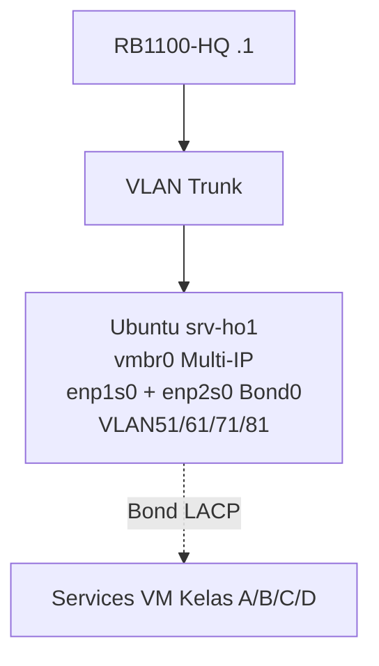

# MINGGU 2: LINUX NETWORK ADMINISTRATION
**Workshop:** Membangun Enterprise Network  
**Tema:** Multi-IP, Routing, Bonding LACP, Bridge & VLAN di Ubuntu Server (VM srv-ho1)  
**Durasi:** 120 menit | **Target:** 4 Kelas x 10 Kelompok (lanjutan Minggu 1 setup)  

## 🎯 TUJUAN PEMBELAJARAN
Setelah praktikum, mahasiswa mampu di Ubuntu VM HoO (Head Office):  
1. Konfigurasi multi-IP pada single interface (aliases) [discourse.pi-hole](https://discourse.pi-hole.net/t/how-to-bind-pi-hole-to-a-specific-ip-alias-on-a-system-using-netplan/60469)
2. Static routing & policy routing sederhana [perplexity]
4. Bridge interface + VLAN subinterfaces  
5. Verifikasi & troubleshoot Linux netplan 

## TOPOLOGI MINGGU 2

Fokus: srv-ho1 di Proxmox (VLAN trunk dari CSS326), akses via 192.168.[LAN].20 

## PREREQUISITE (Dari Minggu 1)
- VM srv-[kelas]-kxx-dns running (ex: srv-a-k01-dns 192.168.1.10)  
- Clone/add VM baru: srv-ho1 ID=201, VLAN Tag=[VLAN_ID], IP static 192.168.[LAN].20  
- Install Ubuntu Server minimal

## 🔧 STEP-BY-STEP

### LANGKAH 1: BASE UBUNTU & MULTI-IP (KELOMPOK 25 MIN)
**SSH ke srv-ho1 (ex Kelas A: ssh admin@192.168.1.20)**
```bash
sudo apt update && sudo apt install -y netplan.io net-tools htop vlan
sudo hostnamectl set-hostname srv-ho1
ip addr  # Cek enp1s0 (vmbr0 passthrough)
```

**Edit /etc/netplan/01-netcfg.yaml (multi-IP aliases):**
```yaml
network:
  version: 2
  renderer: networkd
  ethernets:
    enp1s0:  # NIC utama dari Proxmox
      dhcp4: no
      addresses:
        - 192.168.1.20/24  # HoO Kelas A
        - 192.168.11.20/24 # Alias Kelas B
        - 192.168.21.20/24 # C
        - 192.168.31.20/24 # D
      gateway4: 192.168.1.1
      nameservers:
        addresses: [192.168.1.1, 10.252.108.1]
```
```bash
sudo netplan generate; sudo netplan apply
ip addr show enp1s0  # 4 IP aktif?
ping 192.168.1.1; ping 10.252.108.1  # Backbone?
```


### LANGKAH 2: STATIC & POLICY ROUTING (20 MIN)
**Tambah route ke subnet remote (ex dari Kelas A akses Kelas B):**
```bash
sudo ip route add 192.168.11.0/24 via 10.252.108.61  # RB B gateway
sudo ip route add 192.168.21.0/24 via 10.252.108.71
ip route show  # Verif
```

**Policy Routing (traffic Kelas B via alias B):**
```yaml
# Tambah ke netplan yaml, apply ulang
routing-policy:
  - from 192.168.11.0/24 table 100 priority 10
tables:
  "100":
    default: via 10.252.108.61
```
Test: `ping 192.168.11.10` (VM B hipotetis) 

### LANGKAH 3: BONDING LACP (30 MIN)
**Asumsi 2 NIC VM: enp1s0 (active), enp2s0 (slave)—edit netplan:**
```yaml
bonds:
  bond0:
    interfaces: [enp1s0, enp2s0]
    parameters:
      mode: 802.3ad  # LACP
      lacp-rate: fast
      mii-monitor-interval: 100ms
    addresses: [192.168.1.20/24, 192.168.11.20/24, ...]
```
```bash
netplan apply; cat /proc/net/bonding/bond0  # Active slaves?
```
Test agregasi: `iperf3 -s` (server); client dari VM lain 

### LANGKAH 4: BRIDGE + VLAN SUBINTERFACES (35 MIN)
**Netplan bridge HoO + VLAN (untuk VM services):**
```yaml
bridges:
  br-ho1:
    interfaces: [bond0]
    addresses: []  # No IP bridge
vlan:
  vlan51:
    id: 51
    link: br-ho1
    addresses: [192.168.1.21/24]
  vlan61:
    id: 61
    link: br-ho1
    addresses: [192.168.11.21/24]
```
Attach VM services ke br-ho1 Tag=51/61 dst. Proxmox.  
Test: `ip link; bridge vlan show` 

### LANGKAH 5: VERIFICATION & LAPORAN (10 MIN)
```bash
# Screenshot/save:
ip addr; ip route; ip route show table all
cat /proc/net/bonding/bond0
bridge vlan show; netplan status
ping -c3 192.168.[other].20  # Cross-kelas
```

## CHECKLIST
- [ ] srv-ho1 4 IP + policy route  
- [ ] Bond0 LACP active 2 slaves  
- [ ] Bridge br-ho1 + VLAN51/61 IP  
- [ ] Cross-ping subnets 

## TROUBLESHOOTING
| Masalah             | Solusi                              |
|---------------------|-------------------------------------|
| Netplan apply fail  | `netplan --debug apply`; yaml indent|
| Bond no slave       | LACP support NIC; CSS trunk LACP?   |
| VLAN no traffic     | `tcpdump -i br-ho1 vlan 51`; tag OK |
| Route no cross      | `ip rule show`; table 100 gw benar  |

## DISKUSI
1. Mengapa multi-IP via aliases efisien HoO shared?  
2. Kapan policy routing > static route?  
3. LACP mode 802.3ad vs balance-rr?  

