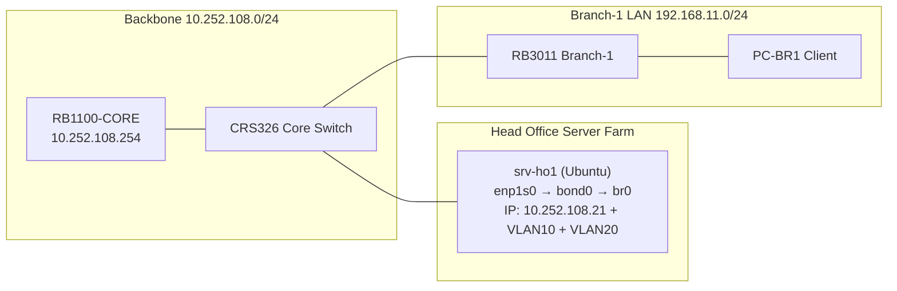

# MINGGU_2_PRAKTIKUM_LENGKAP.md
**Topik:** Linux Network Administration (Multi-IP, Routing, Bonding, Bridge, VLAN)  
**Tema Besar:** Server Head Office sebagai Network Services Node Enterprise [cite:7][cite:18]

---

## 1. Tujuan Pembelajaran

Setelah praktikum Minggu 2, mahasiswa mampu: [cite:7][cite:18]  
- Mengkonfigurasi beberapa IP address pada satu interface Linux server (multi-IP). [web:42]  
- Mengelola routing dasar dan policy routing sederhana di Linux. [web:42][web:45]  
- Membangun bridge dan bonding interface di Linux untuk kebutuhan high-availability / agregasi link. [web:38][web:41]  
- Mengkonfigurasi VLAN interface di Linux untuk terkoneksi langsung ke core switch CRS326. [web:34][web:42]  

---

## 2. Konteks Skenario Enterprise (Lanjutan Minggu 1)

Server `srv-ho1` di Head Office sekarang akan berperan sebagai **network services node** yang terhubung ke beberapa subnet: [cite:12][cite:14]  

- IP management / backbone: 10.252.108.21/24 (seperti Minggu 1). [cite:2][cite:6]  
- IP layanan internal HQ (mis. VLAN-HO-SERVICES): 10.252.10.21/24.  
- IP khusus untuk akses monitoring/backup (mis. VLAN-MGMT): 10.252.20.21/24.  

Pada Minggu 2, kita **belum** mengaktifkan semua VLAN di CRS326, tapi sudah menyiapkan sisi Linux server: multi-IP, bridge/bonding, dan VLAN tagging. Implementasi penuh VLAN di core switch akan dilanjutkan di minggu-minggu berikutnya. [cite:6][web:26]  

---

## 3. Topologi Logis Minggu 2



**Khusus Minggu 2 pada `srv-ho1`:**  
- `bond0` menggabungkan dua NIC (jika fisik tersedia, atau disimulasikan). [web:38][web:44]  
- `br0` sebagai bridge di atas `bond0`.  
- `br0.10` untuk VLAN 10 (HQ services). [web:34]  
- `br0.20` untuk VLAN 20 (management/monitoring).  

---

## 4. Lingkungan Praktikum

### 4.1 Asumsi Perangkat untuk Kelompok

Per kelompok (ideal): [cite:11][cite:14]  
- 1 PC server: `srv-ho1` (Ubuntu Server 22.04/24.04).  
- 1 RB3011 (Branch-1) dan 1 PC-BR1 (client) – sama seperti Minggu 1 (dipakai untuk testing konektivitas).  

### 4.2 Konfigurasi Awal (Dari Minggu 1)

Pastikan sebelum mulai:  
- RB1100-CORE, CRS326, RB3011-BR1, dan PC-BR1 sudah berjalan sesuai MINGGU_1. [cite:2][cite:8]  
- `srv-ho1` sudah punya IP 10.252.108.21/24 dan dapat di-SSH dari PC-BR1. [cite:14]  

---

## 5. Praktik 1 – Multi-IP di Linux

Tujuan: satu NIC (atau bridge) punya beberapa IP sekaligus untuk menjalankan beberapa layanan berbeda. [web:39][web:42]  

### 5.1 Menambahkan Secondary IP pada Interface

Misal kita gunakan interface `enp1s0` (sebelum bonding/bridge diaktifkan).

1. Buka file netplan:  

```bash
sudo nano /etc/netplan/01-netcfg.yaml
```

2. Contoh konfigurasi multi-IP (satu interface, dua IP berbeda subnet):  

```yaml
network:
  version: 2
  ethernets:
    enp1s0:
      dhcp4: false
      addresses:
        - 10.252.108.21/24      # IP backbone
        - 10.252.10.21/24       # IP layanan internal HQ
      gateway4: 10.252.108.254
      nameservers:
        addresses: [202.9.85.3]
```

3. Terapkan konfigurasi:  

```bash
sudo netplan apply
ip addr show enp1s0
```

4. Uji dari PC-BR1:  

```bash
ping 10.252.108.21
ping 10.252.10.21
```

**Pertanyaan cepat:** Apa kegunaan punya dua IP berbeda subnet pada satu server? (Jawab di bagian teori). [web:42]  

---

## 6. Praktik 2 – Routing Dasar & Policy Routing Sederhana

Tujuan: memahami bahwa hanya boleh ada **satu default gateway** per routing table, dan bagaimana menggunakan policy routing jika ada lebih dari satu jalur keluar. [web:42][web:45]  

### 6.1 Melihat Tabel Routing

```bash
ip route
```

Catat:  
- Default route (`default via 10.252.108.254`).  
- Route untuk subnet 10.252.108.0/24 dan 10.252.10.0/24.  

### 6.2 Menambahkan Static Route Tambahan

Misal kita ingin memaksa traffic ke subnet “simulasi branch lain” 192.168.99.0/24 lewat gateway tertentu (anggap RB1100-CORE akan diatur kemudian):

```bash
sudo ip route add 192.168.99.0/24 via 10.252.108.254
ip route
```

### 6.3 Policy Routing (Gambaran Singkat)

Tidak perlu full implement, cukup contoh minimal: 

```bash
# Buat routing table khusus
echo "100 hq-services" | sudo tee -a /etc/iproute2/rt_tables

# Rule: traffic dari IP 10.252.10.21 gunakan table 100
sudo ip rule add from 10.252.10.21 table hq-services

# Tambah default di table 100
sudo ip route add default via 10.252.108.254 table hq-services

# Cek
ip rule
ip route show table hq-services
```

Diskusikan dengan dosen: kapan policy routing ini berguna dalam konteks SD-WAN (Minggu 12) dan multi-uplink? [cite:15][web:31]  

---

## 7. Praktik 3 – Bridge & Bonding di Linux

Tujuan: simulasi server dengan dua link ke CRS326 yang digabung (bonding) dan dipakai sebagai bridge. [web:38][web:41][web:44]  

Jika PC hanya punya 1 NIC fisik, latihan bonding bisa dilakukan secara **konseptual** atau dengan NIC virtual (VM Proxmox). Tetap tulis konfigurasi netplan meski tidak dipakai di fisik. [cite:7]  

### 7.1 Menambahkan Bonding `bond0`

Contoh: dua interface `enp1s0` dan `enp2s0` (atau nama lain sesuai `ip link`).  

```yaml
network:
  version: 2
  ethernets:
    enp1s0: {}
    enp2s0: {}
  bonds:
    bond0:
      interfaces: [enp1s0, enp2s0]
      parameters:
        mode: active-backup
        mii-monitor-interval: 100
      addresses:
        - 10.252.108.21/24
      gateway4: 10.252.108.254
      nameservers:
        addresses: [202.9.85.3]
```

Terapkan:  

```bash
sudo netplan apply
ip addr show bond0
```

Lakukan test failover (jika dua kabel fisik ada): cabut salah satu kabel, lalu ping dari PC-BR1 ke 10.252.108.21, pastikan tetap reply. [web:44]  

### 7.2 Bridge `br0` di atas `bond0`

Untuk topologi lebih enterprise, IP ditempatkan di bridge `br0`.  

```yaml
network:
  version: 2
  ethernets:
    enp1s0: {}
    enp2s0: {}
  bonds:
    bond0:
      interfaces: [enp1s0, enp2s0]
      parameters:
        mode: active-backup
        mii-monitor-interval: 100
  bridges:
    br0:
      interfaces: [bond0]
      addresses:
        - 10.252.108.21/24
      gateway4: 10.252.108.254
      nameservers:
        addresses: [202.9.85.3]
```

Terapkan dan cek:  

```bash
sudo netplan apply
ip addr show br0
```

Diskusi: Mengapa di banyak desain enterprise, IP server diletakkan di bridge, bukan langsung di NIC fisik? (Hint: integrasi dengan KVM/containers). [web:42]  

---

## 8. Praktik 4 – VLAN Interface di Linux

Tujuan: membuat server `srv-ho1` siap untuk dihubungkan ke beberapa VLAN di core switch (HQ services, management). [web:34][web:38]  

### 8.1 Tambah VLAN di atas Bridge

Misal:  
- VLAN 10 = HQ-SERVICES (10.252.10.0/24).  
- VLAN 20 = HQ-MGMT (10.252.20.0/24).  

Tambahkan pada netplan:  

```yaml
network:
  version: 2
  ethernets:
    enp1s0: {}
    enp2s0: {}
  bonds:
    bond0:
      interfaces: [enp1s0, enp2s0]
      parameters:
        mode: active-backup
        mii-monitor-interval: 100
  bridges:
    br0:
      interfaces: [bond0]
  vlans:
    br0.10:
      id: 10
      link: br0
      addresses:
        - 10.252.10.21/24
    br0.20:
      id: 20
      link: br0
      addresses:
        - 10.252.20.21/24
```

Terapkan:  

```bash
sudo netplan apply
ip addr show br0.10
ip addr show br0.20
```

Saat CRS326 nanti dikonfigurasi VLAN trunk (minggu lanjut), IP ini akan dapat di-ping dari subnet lain. [web:34][web:26]  

---

## 9. Tugas Praktikum

### 9.1 Tugas Konfigurasi

Untuk setiap kelompok:  

1. Buat konfigurasi netplan yang memuat: [cite:7][web:42]  
   - `bond0` (mode active-backup, 2 interface).  
   - `br0` di atas `bond0`.  
   - Multi-IP: 10.252.108.21/24 di `br0`, 10.252.10.21/24 di `br0.10`.  
2. Pastikan dari PC-BR1 minimal bisa **ping** ke IP 10.252.108.21 (via backbone).  
3. Tunjukkan output: `ip addr`, `ip route`, dan isi file `/etc/netplan/01-netcfg.yaml`.  
4. (Jika VLAN di CRS326 sudah diaktifkan oleh dosen): uji ping 10.252.10.21 dari PC-BR1, dan catat hasilnya.  

### 9.2 Pertanyaan Teori

Jawab singkat (2–4 kalimat):  

1. Apa perbedaan antara **multi-IP** pada satu interface dengan memiliki beberapa interface fisik berbeda? Kapan multi-IP lebih efisien? [web:42]  
2. Jelaskan perbedaan fungsi **bonding** dan **bridge** di Linux. Berikan contoh penggunaan dalam jaringan enterprise. [web:38][web:41]  
3. Mengapa sebaiknya hanya ada satu **default gateway** per routing table di Linux? Apa dampaknya jika ada dua default gateway tanpa policy routing? [web:42][web:45]  
4. Dalam konteks enterprise network dengan banyak VLAN, apa keuntungan membuat interface VLAN di server langsung (mis. `br0.10`) dibandingkan menambah router fisik baru? [web:34][web:38]  

### 9.3 Pertanyaan Setelah Praktik (Refleksi)

1. Bagian mana yang paling sering menyebabkan error: sintaks YAML netplan, nama interface, atau routing? Bagaimana cara Anda melakukan troubleshooting? [web:45]  
2. Jika nanti server `srv-ho1` akan menjalankan banyak container (Minggu 9) dan pod Kubernetes (Minggu 10), bagaimana desain bridge/bonding/VLAN minggu ini membantu kemudahan integrasi? [cite:17][web:24]  
3. Dalam skenario nyata di data center, apakah Anda lebih memilih bonding mode active-backup atau 802.3ad (LACP)? Jelaskan pertimbangan teknisnya singkat. [web:38][web:41]  

---

## 10. Output yang Harus Dikumpulkan

Satu laporan per kelompok (PDF/Markdown): [cite:7][cite:18]  

1. Isi lengkap `/etc/netplan/01-netcfg.yaml` yang digunakan.  
2. Screenshot/hasil:  
   - `ip addr` (menunjukkan `bond0`, `br0`, `br0.10` jika diaktifkan).  
   - `ip route`.  
   - Hasil `ping` dari PC-BR1 ke 10.252.108.21.  
3. Jawaban pertanyaan teori (9.2) dan refleksi (9.3).  

---

## 11. Checklist Asisten/Instruktur

- [ ] Server `srv-ho1` dapat di-SSH dari PC-BR1. [cite:14]  
- [ ] Multi-IP di server (10.252.108.21 + 10.252.10.21) terkonfigurasi benar. [web:42]  
- [ ] Konfigurasi bonding/bridge netplan valid dan bisa di-apply tanpa error. [web:38][web:45]  
- [ ] Tabel routing tidak memiliki conflict default gateway. [web:42]  
- [ ] Laporan berisi file netplan, output perintah, dan jawaban pertanyaan. [cite:7][cite:18]  

---

