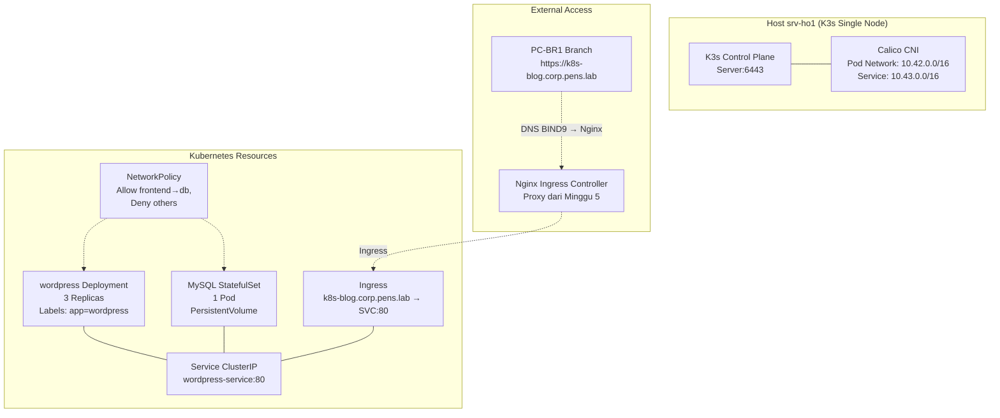

# MINGGU_10_K8S
**Topik:** Kubernetes Networking (K3s cluster, Calico CNI, NetworkPolicy)  
**Tema Besar:** Orchestration Enterprise Apps di Head Office Container Platform [cite:17][cite:18]

---

## 1. Tujuan Pembelajaran

Setelah praktikum Minggu 10, mahasiswa mampu: [cite:17][cite:18]  
- Menginstall **K3s** lightweight Kubernetes cluster di single/multi node.  
- Memahami **Calico CNI** untuk Pod/Service networking antar node.  
- Mengkonfigurasi **NetworkPolicy** untuk microsegmentation keamanan.  
- Deploy aplikasi enterprise (WordPress dari Minggu 9) ke Kubernetes via Helm.  

---

## 2. Konteks Skenario Enterprise (Lanjutan Minggu 1-9)

**Kubernetes Platform di Head Office** (`srv-ho1` + VM tambahan): [cite:14][cite:17]  
- **K3s cluster**: single-node untuk development, multi-node simulasi production.  
- **Calico CNI**: Pod-to-Pod communication, NetworkPolicy untuk security.  
- **Apps deployment**:  
  - WordPress cluster (replicated frontend + MySQL StatefulSet).  
  - Monitoring stack (Prometheus/Grafana operator).  
- **Integration**:  
  - Ingress via Nginx (Minggu 5) → Kubernetes Service.  
  - DNS BIND9 resolve service names. [cite:1]  

Akses: `k8s-blog.corp.pens.lab` → Ingress → WordPress Pods.  

---

## 3. Topologi Kubernetes Networking



**Flow:** Branch PC → Nginx Ingress → K8s Service → Pods (Calico routed).  

---

## 4. Lingkungan Praktikum

Per kelompok: [cite:11][cite:14]  
- `srv-ho1` (Ubuntu 22.04+, Docker aktif Minggu 9).  
- Minimal 8GB RAM free untuk K3s + workloads.  
- Akses `sudo` dan SSH persistent.  

**Single-node OK untuk lab**, multi-node bonus jika resource memadai.  

---

## 5. Langkah Praktikum

### 5.1 Install K3s Cluster (Single Node)

```bash
# Install K3s server (embedded etcd, Traefik disabled)
curl -sfL https://get.k3s.io | sh -

# Copy kubeconfig
mkdir -p $HOME/.kube
sudo cp /etc/rancher/k3s/k3s.yaml $HOME/.kube/config
sudo chown $(id -u):$(id -g) $HOME/.kube/config

# Verify
kubectl get nodes
kubectl get pods --all-namespaces
```

### 5.2 Install Calico CNI (Replace Default)

K3s default Flannel, replace dengan Calico:  

```bash
# Download Calico manifest
kubectl apply -f https://raw.githubusercontent.com/projectcalico/calico/v3.27.3/manifests/calico.yaml

# Install Calico operator (simplified)
kubectl create -f https://raw.githubusercontent.com/projectcalico/calico/v3.27.3/manifests/tigera-operator.yaml
kubectl create -f https://raw.githubusercontent.com/projectcalico/calico/v3.27.3/manifests/custom-resources.yaml

# Verify CNI
kubectl get pods -n calico-system
```

### 5.3 Deploy WordPress App dengan Helm

1. **Install Helm:**  

```bash
curl https://raw.githubusercontent.com/helm/helm/main/scripts/get-helm-3 | bash
helm version
```

2. **Add WordPress chart & deploy:**  

```bash
helm repo add bitnami https://charts.bitnami.com/bitnami
helm install wp-cluster bitnami/wordpress \
  --set wordpressUsername=admin \
  --set wordpressPassword=pens123 \
  --set mariadb.auth.rootPassword=rootpens123 \
  --set service.type=ClusterIP \
  --set ingress.enabled=true \
  --set ingress.hostname=k8s-blog.corp.pens.lab
```

3. **Verify deployment:**  

```bash
kubectl get pods,svc,ingress
kubectl get endpoints wordpress
kubectl logs deployment/wordpress -f
```

### 5.4 Konfigurasi NetworkPolicy Security

Buat `network-policy.yaml`:  

```yaml
apiVersion: networking.k8s.io/v1
kind: NetworkPolicy
metadata:
  name: wordpress-network-policy
spec:
  podSelector:
    matchLabels:
      app.kubernetes.io/name: wordpress
  policyTypes:
  - Ingress
  - Egress
  ingress:
  - from:
    - podSelector:
        matchLabels:
          app.kubernetes.io/name: mariadb
    ports:
    - protocol: TCP
      port: 80
  egress:
  - to:
    - podSelector:
        matchLabels:
          app.kubernetes.io/name: mariadb
    ports:
    - protocol: TCP
      port: 3306
```

Apply: `kubectl apply -f network-policy.yaml`

Test: label pod lain, coba akses (harus diblok).  

### 5.5 Integrasi dengan Enterprise Infrastructure

1. **Update BIND9** (Minggu 3): `k8s-blog.corp.pens.lab A 10.252.108.21`.  

2. **Nginx Ingress** (Minggu 5): tambah location:  

```nginx
location /k8s-blog/ {
    proxy_pass http://127.0.0.1:80/;  # K3s Traefik atau Ingress controller port
    proxy_set_header Host k8s-blog.corp.pens.lab;
    proxy_set_header X-Real-IP $remote_addr;
}
```

3. **Test dari PC-BR1:** `https://portal.corp.pens.lab/k8s-blog/` → WordPress K8s.  

---

## 6. Tugas Praktikum

### 6.1 Tugas Konfigurasi

1. Install **K3s + Calico CNI** di `srv-ho1`.  
2. Deploy **WordPress cluster** via Helm (3 replicas frontend).  
3. Buat **NetworkPolicy** yang:  
   - Allow frontend → database port 3306.  
   - Deny akses dari pod lain.  
4. **Expose via Nginx proxy** dan test dari PC-BR1.  
5. **Scale test**: `kubectl scale deployment wordpress --replicas=5`, observe traffic.  

### 6.2 Pertanyaan Teori

1. Apa perbedaan **K3s** vs **full Kubernetes**? Keuntungan K3s untuk edge/enterprise lab?  
2. Jelaskan **Calico CNI** vs **Flannel**. Mengapa Calico lebih cocok untuk NetworkPolicy? [cite:17]  
3. Apa fungsi **StatefulSet** vs **Deployment**? Kapan pakai untuk database?  
4. Bagaimana **Ingress** berbeda dari **Service LoadBalancer**? Integrasi dengan Nginx reverse proxy?  

### 6.3 Pertanyaan Setelah Praktik

1. K3s nodes ready? Calico pods running?  
2. WordPress K8s accessible dari branch? NetworkPolicy blok traffic unauthorized?  
3. Scaling replicas bekerja? Observe dengan `kubectl get pods`.  

---

## 7. Output yang Harus Dikumpulkan

Laporan: [cite:17][cite:18]  

1. Output:  
   - `kubectl get nodes,pods,svc,networkpolicies -A`.  
   - Helm values WordPress deployment.  
   - NetworkPolicy YAML.  

2. Screenshot:  
   - K8s dashboard WordPress dari PC-BR1.  
   - `kubectl top pods` resource usage.  
   - NetworkPolicy deny test.  

3. Jawaban pertanyaan.  

---

## 8. Checklist Asisten

- [ ] K3s cluster running, Calico CNI active.  
- [ ] WordPress Helm deployment sukses (Pods Ready).  
- [ ] NetworkPolicy implemented dan tested.  
- [ ] External access via Nginx proxy dari branch.  
- [ ] Scaling test OK.  

**Troubleshooting:**  
| Masalah | Solusi |  
|---------|--------|  
| Pods CrashLoop | `kubectl logs pod-name`, cek PVC/storage |  
| CNI issues | `kubectl get daemonsets -n kube-system` |  
| Ingress 404 | Host header di Nginx proxy_pass |  

---

