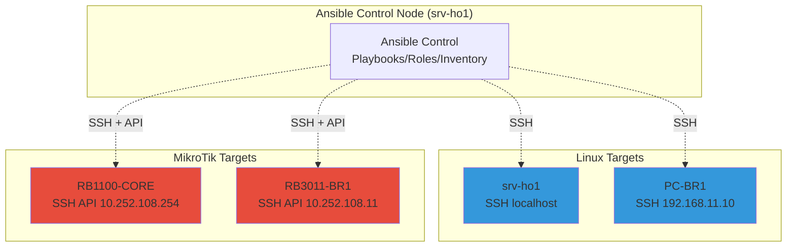

# MINGGU_11_ANSIBLE_LENGKAP.md
**Topik:** Network Automation (Ansible playbooks, roles, inventory)  
**Tema Besar:** IaC untuk Enterprise Network Configuration Management [cite:17][cite:18]

---

## 1. Tujuan Pembelajaran

Setelah praktikum Minggu 11, mahasiswa mampu: [cite:17][cite:18]  
- Menginstall **Ansible** dan membuat **inventory** untuk Linux + MikroTik targets.  
- Menulis **Ansible playbooks** untuk konfigurasi services (DHCP, BIND9, Nginx).  
- Membuat **Ansible roles** yang reusable untuk network services.  
- Mengotomasi **backup config** dan **compliance check** seluruh enterprise network.  

---

## 2. Konteks Skenario Enterprise (Lanjutan Minggu 1-10)

**Ansible Control Tower di Head Office** (`srv-ho1`): [cite:17][cite:18]  
- **Inventory targets**:  
  - srv-ho1 (localhost).  
  - RB1100-CORE, RB3011-BR1 (via SSH API).  
  - PC-BR1 (Linux client).  
- **Automation goals**:  
  - Deploy BIND9/DHCP config ke multiple servers.  
  - Backup MikroTik config otomatis.  
  - Compliance: cek Nginx config syntax di semua web servers.  

Integrasi: Ansible push config → Prometheus scrape metrics baru → Grafana update. [cite:7]  

---

## 3. Topologi Ansible Automation



**Flow:** `ansible-playbook deploy-dns.yml` → push config ke semua targets.  

---

## 4. Lingkungan Praktikum

Per kelompok: [cite:11][cite:14]  
- `srv-ho1` sebagai Ansible control node (`sudo` access).  
- Targets: RB1100-CORE, RB3011-BR1, PC-BR1 (SSH enabled).  
- SSH keys sudah setup antar devices (passwordless).  

---

## 5. Langkah Praktikum

### 5.1 Install Ansible di srv-ho1

```bash
sudo apt update
sudo apt install -y ansible ansible-lint sshpass python3-paramiko

# Ansible collections untuk networking
ansible-galaxy collection install community.general
ansible-galaxy collection install community.routeros  # MikroTik
```

### 5.2 Setup SSH Keys (Passwordless)

```bash
ssh-keygen -t rsa -b 4096 -f ~/.ssh/ansible_key -N ""
ssh-copy-id -i ~/.ssh/ansible_key root@192.168.11.10  # PC-BR1
# Copy ke MikroTik via Winbox atau SSH manual
```

### 5.3 Buat Ansible Inventory (inventory.yml)

```bash
mkdir ~/ansible-lab && cd ~/ansible-lab
nano inventory.yml
```

Isi multi-group inventory:  

```yaml
all:
  children:
    linux_servers:
      hosts:
        srv-ho1:
          ansible_host: localhost
          ansible_connection: local
        pc-br1:
          ansible_host: 192.168.11.10
          ansible_user: root
          ansible_ssh_private_key_file: ~/.ssh/ansible_key
    mikrotik_routers:
      hosts:
        rb1100-core:
          ansible_host: 10.252.108.254
          ansible_network_os: routeros
          ansible_user: admin
          ansible_ssh_private_key_file: ~/.ssh/ansible_key
        rb3011-br1:
          ansible_host: 10.252.108.11
          ansible_network_os: routeros
          ansible_user: admin
          ansible_ssh_private_key_file: ~/.ssh/ansible_key
```

Test connectivity:  

```bash
ansible-inventory -i inventory.yml --list
ansible all -i inventory.yml -m ping
```

### 5.4 Playbook 1: Deploy BIND9 Config (linux_servers)

Buat `playbooks/deploy-dns.yml`:  

```yaml
***
- name: Deploy BIND9 configuration
  hosts: linux_servers
  become: yes
  tasks:
    - name: Install BIND9
      apt:
        name: bind9
        state: present
    
    - name: Copy zone file
      copy:
        src: files/db.corp.pens.lab
        dest: /etc/bind/db.corp.pens.lab
        owner: bind
        group: bind
        mode: '0644'
    
    - name: Restart BIND9
      systemd:
        name: bind9
        state: restarted
        enabled: yes
    
    - name: Test DNS resolution
      command: dig srv-ho1.corp.pens.lab @localhost
      register: dns_test
    
    - name: Display DNS result
      debug:
        msg: "{{ dns_test.stdout_lines }}"
```

Test: `ansible-playbook -i inventory.yml playbooks/deploy-dns.yml`

### 5.5 Playbook 2: MikroTik Backup & Compliance (mikrotik_routers)

Buat `playbooks/backup-mikrotik.yml`:  

```yaml
***
- name: MikroTik Backup and Compliance
  hosts: mikrotik_routers
  gather_facts: no
  collections:
    - community.routeros
  tasks:
    - name: Backup configuration
      community.routeros.command:
        commands: /export compact file=backup-{{ inventory_hostname }}.rsc
      register: backup_result
    
    - name: Download backup file
      fetch:
        src: "/backup-{{ inventory_hostname }}.rsc"
        dest: "backups/{{ inventory_hostname }}-{{ ansible_date_time.date }}.rsc"
        flat: yes
    
    - name: Check DNS configuration compliance
      community.routeros.command:
        commands: /ip dns print
      register: dns_config
    
    - name: Verify DNS allow-remote-requests
      assert:
        that:
          - "'allow-remote-requests=yes' in dns_config.stdout"
        fail_msg: "DNS allow-remote-requests NOT enabled on {{ inventory_hostname }}"
    
    - name: Display compliance status
      debug:
        msg: "{{ inventory_hostname }} compliance: PASS"
```

Test: `ansible-playbook -i inventory.yml playbooks/backup-mikrotik.yml`

### 5.6 Ansible Roles (Reusable)

Buat structure role:  

```bash
mkdir -p roles/common/tasks roles/common/handlers
ansible-galaxy init roles/common
```

`roles/common/tasks/main.yml`:  

```yaml
***
- name: Update system
  apt:
    update_cache: yes
    cache_valid_time: 3600

- name: Install common packages
  apt:
    name:
      - htop
      - vim
      - curl
    state: present

- name: Enable SSH
  systemd:
    name: ssh
    enabled: yes
    state: started
```

Gunakan di playbook:  

```yaml
- name: Apply common role
  hosts: all
  roles:
    - common
```

### 5.7 Advanced: Dynamic Inventory & Vault

**Dynamic inventory MikroTik** (opsional): gunakan script yang query SNMP.  

**Ansible Vault** untuk secrets:  

```bash
ansible-vault create group_vars/all/vault.yml
# Isi: mikrotik_password: supersecret
ansible-playbook --ask-vault-pass playbooks/deploy-dns.yml
```

---

## 6. Tugas Praktikum

### 6.1 Tugas Konfigurasi

1. Buat **inventory.yml** dengan 4 targets (2 Linux + 2 MikroTik).  
2. Tulis **2 playbooks**:  
   - `deploy-common.yml`: install htop+vim di semua Linux targets.  
   - `mikrotik-compliance.yml`: backup config + cek DNS settings.  
3. Buat **Ansible role** `webserver` yang:  
   - Install Nginx.  
   - Copy index.html custom kelompok.  
   - Start service.  
4. **Test idempotency**: jalankan playbook 2x berturut, pastikan no changes di run kedua.  
5. **Backup otomatis**: playbook yang taruh MikroTik backup ke /backup/ansible/.  

### 6.2 Pertanyaan Teori

1. Apa **idempotency** Ansible? Mengapa krusial untuk IaC?  
2. Jelaskan **inventory groups** vs **host vars**. Contoh penggunaan di multi-site enterprise.  
3. Perbedaan **community.routeros** vs native SSH untuk MikroTik automation?  
4. Bagaimana Ansible **handlers** berbeda dari **tasks**? Kapan pakai?  

### 6.3 Pertanyaan Setelah Praktik

1. Semua targets `ping` sukses? Playbooks idempotent?  
2. MikroTik backup files ada di folder? Compliance check PASS semua?  
3. Role `webserver` deploy Nginx sukses di target mana saja?  

---

## 7. Output yang Harus Dikumpulkan

Laporan: [cite:17][cite:18]  

1. Files:  
   - `inventory.yml`  
   - `playbooks/deploy-common.yml`, `playbooks/mikrotik-compliance.yml`  
   - `roles/webserver/tasks/main.yml`  
   - Backup MikroTik files.  

2. Screenshot:  
   - `ansible all -m ping`  
   - Playbook run verbose (`-v`), idempotent run #2  
   - Nginx running dari role di target.  

3. Jawaban pertanyaan.  

---

## 8. Checklist Asisten

- [ ] Inventory multi-group, connectivity OK.  
- [ ] 2 playbooks sukses + idempotent.  
- [ ] Ansible role `webserver` working.  
- [ ] MikroTik backup + compliance check.  
- [ ] Laporan lengkap.  

**Troubleshooting:**  
| Masalah | Solusi |  
|---------|--------|  
| SSH fail | SSH keys, `ansible_user`, `become` |  
| MikroTik API | `ansible_connection=network_cli`, collection installed |  
| Idempotent fail | `changed_when: false`, `creates:` |  

---

