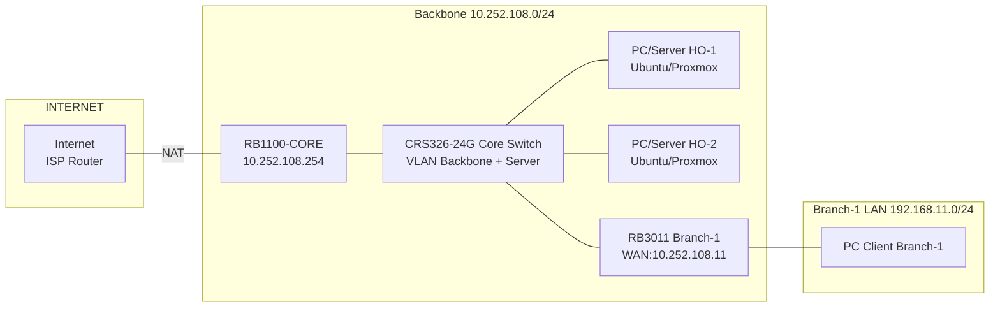

text
# MINGGU_1_PRAKTIKUM_LENGKAP.md  
**Topik:** Setup Environment Lab & Desain Super Network  
**Tema Besar:** Membangun Enterprise Network – Head Office & 10 Branch Office [cite:8][cite:18]

---

## 1. Tujuan Pembelajaran

Setelah praktikum Minggu 1, mahasiswa mampu: [cite:8][cite:18]  
- Menjelaskan desain **super** network enterprise: Head Office (HQ) dan Branch Office.  
- Mengkonfigurasi backbone lab dengan CRS326 sebagai core switch dan RB1100 sebagai core router/gateway. [cite:2][cite:6]  
- Menghubungkan minimal 1 RB3011 dan 1 PC sebagai “Branch-1” yang dapat mengakses backbone dan internet. [cite:11][cite:12]  
- Menginstall Ubuntu Server di PC/VM dan mengaktifkan akses SSH sebagai fondasi minggu-minggu berikutnya. [cite:14][cite:18]  

---

## 2. Deskripsi Singkat Skenario Enterprise

Perusahaan fiktif: **PT. PENS Enterprise Network**  

- **Head Office (HO / Data Center):**  
  - Core router: RB1100-CORE.  
  - Core switch: CRS326-24G sebagai backbone VLAN.  
  - Server farm: beberapa PC/VM untuk Proxmox, DNS, Web, Monitoring, Identity. [cite:12][cite:14]  

- **Branch Office (BO):**  
  - Tiap branch memiliki 1 router RB3011 dan 1–2 PC.  
  - Branch terhubung ke HO via backbone 10.252.108.0/24 (di lab semua perangkat berada di satu ruangan). [cite:11][cite:12]  

Minggu 1: membangun tulang punggung (backbone + 1 branch) sebagai baseline semua praktikum. [cite:8][cite:18]  

---

## 3. Topologi Fisik & Logis

### 3.1 Topologi Fisik Lab (Satu HO + Satu Branch)



Contoh mapping port (sesuaikan dengan kondisi lab): [cite:2][cite:6]

RB1100-CORE ether1 → Internet/ISP.

RB1100-CORE ether10 → CRS326 (backbone).

CRS326 ether2 → RB3011 Branch-1.

CRS326 ether3,4 → PC/Server HO.

RB3011 ether2 → PC Branch-1.

### 3.2 Skema IP (Sederhana, Tanpa VLAN Detail Dulu)
Backbone: [cite:2][cite:6]

10.252.108.1 → Router/ISP (gateway internet).

10.252.108.254 → RB1100-CORE (default gateway enterprise).

10.252.108.2 → CRS326 (management).

10.252.108.11 → RB3011-BR1 (interface ke backbone).

10.252.108.21–22 → PC-HO1/HO2 (server head office).

LAN Branch-1:

192.168.11.1 → RB3011-BR1 (gateway LAN).

192.168.11.10 → PC-BR1 (client).

## 4. Langkah Praktikum
### 4.1 Persiapan Awal
1. Bentuk kelompok 2–3 mahasiswa.

2. Setiap kelompok minimal bertanggungjawab:

  - 1 RB3011 (Branch-1 kelompok). [cite:11]

  - 1 PC (PC-BR1) sebagai client atau server Ubuntu.

  - Tetapkan nomor kelompok: K01, K02, … (akan dipakai IP khusus di minggu berikutnya). [cite:18]

### 4.2 Konfigurasi RB1100-CORE (Head Office Router)
1. Masuk ke RB1100-CORE via Winbox/SSH.

2. (Opsional) Reset konfigurasi ke default lab.

3. Set IP interface ke internet (ether1) dan backbone (ether10): [cite:2][cite:6]

```bash
# IP ke ISP/internet
/ip address add address=192.168.8.2/24 interface=ether1 comment="Link ke ISP"

# Default route ke ISP
/ip route add dst-address=0.0.0.0/0 gateway=192.168.8.1

# IP ke backbone lab
/ip address add address=10.252.108.254/24 interface=ether10 comment="Backbone core"
Aktifkan NAT dari backbone ke internet: [cite:2][cite:6]
```

```bash
/ip firewall nat add chain=srcnat src-address=10.252.108.0/24 out-interface=ether1 action=masquerade
Set DNS resolver RB1100 (sementara pakai DNS ISP):
```
```bash
/ip dns set servers=202.9.85.3 allow-remote-requests=yes
```
### 4.3 Konfigurasi CRS326 (Core Switch)

Ruang lingkup Minggu 1 :

  1. Memberi IP management.

  2. Menghubungkan RB1100, RB3011, dan PC/Server secara satu segmen (belum VLAN filtering kompleks). [cite:6][web:26]

  3. Set IP management (SwOS/RouterOS, sesuaikan tipe OS):

    - IP: 10.252.108.2/24

    - Gateway: 10.252.108.254

  4. Koneksi fisik:

    - Port1 → RB1100-CORE (ether10).
    
    - Port2 → RB3011-BR1 (ether1).
    
    - Port3 → PC-HO1.
    
    - Port4 → PC-HO2 (opsional).

5. Uji konektivitas (bila RouterOS): ping 10.252.108.254 dan 10.252.108.1 dari CRS326. [cite:3]

### 4.4 Konfigurasi RB3011-BRANCH-1
1. Masuk ke RB3011 via Winbox/SSH (ether1 ke CRS326).
2. Set IP backbone dan LAN: [cite:6][cite:11]

```bash
# IP ke backbone
/ip address add address=10.252.108.11/24 interface=ether1 comment="Backbone Branch-1"

# IP ke LAN Branch-1
/ip address add address=192.168.11.1/24 interface=ether2 comment="LAN Branch-1"
```

3. Default route Branch-1 ke RB1100-CORE:

```bash
/ip route add dst-address=0.0.0.0/0 gateway=10.252.108.254
(Opsional) DHCP server di LAN Branch-1:

bash
/ip pool add name=pool-br1 ranges=192.168.11.10-192.168.11.100
/ip dhcp-server add name=dhcp-br1 interface=ether2 address-pool=pool-br1 lease-time=1h
/ip dhcp-server network add address=192.168.11.0/24 gateway=192.168.11.1 dns-server=10.252.108.254
```

### 4.5 Konfigurasi PC-HO1 / Ubuntu Server
PC ini akan menjadi salah satu server di Head Office (nantinya untuk DNS/Web/Monitoring). Minggu 1: install OS + SSH + IP statis. [cite:14][cite:18]

  1. Install Ubuntu Server 24.04 (atau setara):

    - Hostname: srv-ho1.
    
    - User: adminXX (XX = nomor kelompok).

  2. Set IP statis via netplan:

```bash
# nano /etc/netplan/01-netcfg.yaml
network:
  version: 2
  ethernets:
    enp1s0:
      dhcp4: false
      addresses:
        - 10.252.108.21/24
      gateway4: 10.252.108.254
      nameservers:
        addresses: [202.9.85.3]
```

  3. Jalankan:

```bash
sudo netplan apply
```
  4. Install dan aktifkan SSH:

```bash
sudo apt update
sudo apt install -y openssh-server
sudo systemctl enable --now ssh
```
  5. Tes dari PC-BR1:

```bash
ssh adminXX@10.252.108.21
```
### 4.6 Konfigurasi PC-BR1 (Client Branch-1)
1. Konfigurasi IP (static atau DHCP dari RB3011):

- Jika static:

  - IP: 192.168.11.10

  - Netmask: 255.255.255.0

  - Gateway: 192.168.11.1

  - DNS: 202.9.85.3 (sementara)

2. Uji konektivitas dari PC-BR1:

```bash
ping 192.168.11.1        # gateway LAN (RB3011)
ping 10.252.108.11       # RB3011-BR1 backbone
ping 10.252.108.254      # RB1100-CORE
ping 10.252.108.21       # srv-ho1 (server HO)
ping 8.8.8.8             # internet (jika jalur ISP aktif)
ping google.com          # test DNS + internet
```
Semua ping internal (sampai RB1100 dan srv-ho1) harus berhasil sebelum lanjut ke minggu berikutnya. [cite:2][cite:6]

## 5. Tugas Praktikum
### 5.1 Tugas Konfigurasi
Untuk setiap kelompok:

1. Gambar ulang topologi kelompok (dengan IP dan nomor port sebenarnya) menggunakan Mermaid. [cite:8]

2. Konfigurasi RB1100-CORE, CRS326, RB3011-BR1, PC-HO1, dan PC-BR1 sehingga:

- PC-BR1 dapat ping ke internet dan ke srv-ho1.

- srv-ho1 dapat diakses via SSH dari PC-BR1.

3. Dokumentasikan semua perintah konfigurasi MikroTik dan Ubuntu yang digunakan. [cite:18]

### 5.2 Pertanyaan Teori
Jawab singkat (2–4 kalimat):

1. Jelaskan perbedaan peran core router (RB1100) dan core switch (CRS326) dalam desain enterprise network. [cite:5][web:19]

2. Mengapa backbone menggunakan subnet 10.252.108.0/24 yang berbeda dari subnet LAN branch 192.168.11.0/24? [cite:6][cite:11]

3. Sebutkan minimal dua keuntungan menempatkan server pusat (DNS, Web, Monitoring) di Head Office dibanding di setiap branch. [cite:12][cite:14]

4. Apa risiko jika NAT hanya dilakukan di RB3011 branch dan bukan di core router RB1100-CORE? Berikan contoh problem saat monitoring. [cite:2][cite:7]

###5.3 Pertanyaan Setelah Praktik (Refleksi)
1. Bagian mana yang paling sulit: konfigurasi MikroTik, Ubuntu, atau troubleshooting? Jelaskan.

2. Jika jumlah branch menjadi 10 (RB3011-1 s/d RB3011-10), aspek apa yang pertama kali perlu diotomasi? Kaitkan dengan materi Minggu 11 (Ansible). [cite:17][cite:18]

3. Jika koneksi internet putus di level ISP, layanan apa saja yang tetap dapat diakses oleh user di branch? Jelaskan berdasarkan topologi. [cite:12]

## 6. Output yang Harus Dikumpulkan
Setiap kelompok mengumpulkan (1 file PDF atau Markdown): [cite:8][cite:18]

Screenshot:

1. RB1100-CORE (IP dan route).

2. RB3011-BR1 (IP dan route).

3. PC-HO1 (ip a, ip route, systemctl status ssh).

4. PC-BR1 (hasil ping ke target di bagian 4.6).

5. Listing konfigurasi:

    - Perintah MikroTik di RB1100 dan RB3011.
    
    - Isi file netplan di PC-HO1.
    
    - Diagram topologi kelompok (Mermaid) dengan IP aktual.
    
    - Jawaban pertanyaan teori dan refleksi (5.2 dan 5.3).

## 7. Checklist Asisten/Instruktur
Untuk penilaian cepat di lab:

- [ ] RB1100-CORE: IP backbone & NAT ke internet benar. [cite:2][cite:6]

- [ ] CRS326: dapat ping ke RB1100-CORE & IP backbone. [cite:3]

- [ ] RB3011-BR1: default route ke 10.252.108.254 sudah ada. [cite:6][cite:11]

- [ ] PC-HO1: IP statis benar, SSH aktif. [cite:14]

- [ ] PC-BR1: bisa ping RB3011, RB1100, PC-HO1, dan (jika tersedia) internet. [cite:2][cite:6]

 Laporan lengkap: screenshot, konfigurasi, diagram, dan jawaban pertanyaan. [cite:8][cite:18]

