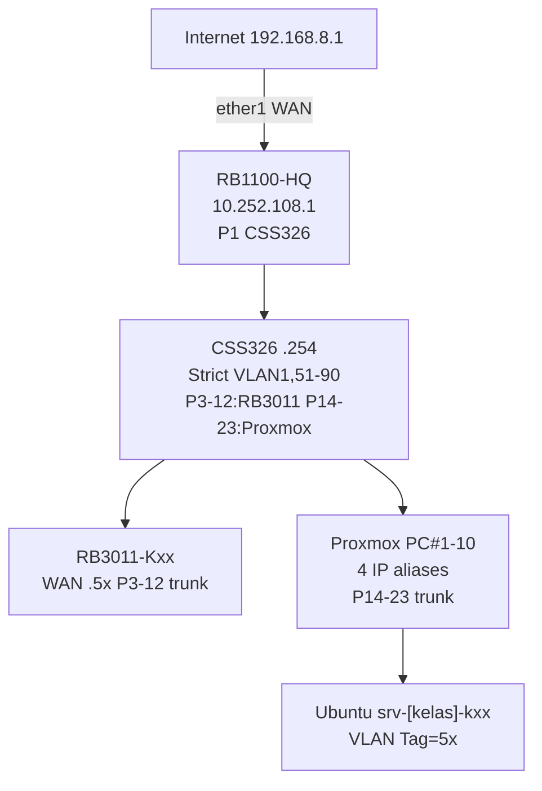

# MINGGU 1: SETUP ENVIRONMENT LAB - ENTERPRISE NETWORK BACKBONE
**Workshop:** Membangun Enterprise Network  
**Tema:** Backbone 10.252.108.0/24 + CSS326 VLAN Trunk + Proxmox 4 IP Aliases (.151-.190)  
**Durasi:** 120 menit | **Target:** 4 Kelas x 10 Kelompok (10 RB3011, 10 Proxmox PC shared)  

## 🎯 TUJUAN PEMBELAJARAN
Setelah praktikum, mahasiswa mampu:  
1. Setup lengkap **CSS326 SwOS** VLAN strict trunk & management [wiki.mikrotik](https://wiki.mikrotik.com/SWOS/CSS326-VLAN-Example)
2. Konfigurasi RB1100-HQ gateway & RB3011 branch VLAN [help.mikrotik](https://help.mikrotik.com/docs/spaces/ROS/pages/103841826/Basic+VLAN+switching)
3. Proxmox setiap PC 4 IP aliases (A/B/C/D) [servethehome](https://www.servethehome.com/how-to-assign-a-second-ip-address-to-proxmox-ve-hosts/)
4. Deploy Ubuntu VM VLAN per kelas [virtualizationhowto](https://www.virtualizationhowto.com/2025/01/proxmox-network-configuration-for-beginners-including-vlans/)
5. Verifikasi end-to-end VM → Internet 
## TOPOLOGI


Shared Proxmox: 1 PC = 4 kelas via aliases + VM VLAN [virtualizationhowto](https://www.virtualizationhowto.com/2025/01/proxmox-network-configuration-for-beginners-including-vlans/)

## SKEMA IP & PORT CSS326
| Kelas | VLAN  | RB3011 WAN | LAN          | Proxmox PC#1-10 | CSS Port     |
|-------|-------|------------|--------------|-----------------|--------------|
| A     | 51-60| .51-.60   | 192.168.1-10 | .151-.160 utama| P3-12/P14-23 |
| B     | 61-70| .61-.70   | 192.168.11-20| .161-.170 alias | trunk        |
| C     | 71-80| .71-.80   | 192.168.21-30| .171-.180 alias |              |
| D     | 81-90| .81-.90   | 192.168.31-40| .181-.190 alias |              | 

**HQ .1 P1 trunk | CSS Mgmt .254**  [wiki.mikrotik](https://wiki.mikrotik.com/SWOS/CSS326-VLAN-Example)

## 🔧 STEP-BY-STEP

### 1. CSS326 SwOS FULL SETUP (ASISTEN/DEMO 20 MIN)
```
1. Browser: http://192.168.88.1 → admin/no pass
2. System → Reset Config → No Defaults → Reset Configuration

3. Hosts Add:
   IP: 10.252.108.254/24 | GW: 10.252.108.1 → Apply
   Test ping 10.252.108.1

4. VLAN Mode: strict

5. VLAN Table (add rows):
   VLAN1: Ports P1(t),P3-12(t),P14-23(t)  [mgmt/backbone]
   VLAN51-60: P1(t),P3-12(t),P14-23(t)   [A tagged]
   VLAN61-70: P1(t),P3-12(t),P14-23(t)   [B]
   VLAN71-80: P1(t),P3-12(t),P14-23(t)   [C]
   VLAN81-90: P1(t),P3-12(t),P14-23(t)   [D]

6. Port Settings:
   P1 HQ: Frame=tag, VLAN=secure, Default VLAN1, Allowed=1,51-90
   P3-12 RB: tag/secure/Default1 Allowed=1,51-90
   P14-23 PVE: tag/secure/Default1 Allowed=1,51-90

Screenshot: VLAN Table, Ports, Hosts
```
Test: Ports green, no drops [kapes](https://www.kapes.biz/Blog/swos_css326_vlan-blog.aspx)

### 2. RB1100-HQ GATEWAY (10 MIN)
```routeros
/system reset no-defaults=yes
/int bridge add bridge-hq vlan-filtering=yes
/int bridge port add bridge=bridge-hq int=ether1-2  #1 WAN
/ip addr add 10.252.108.1/24 int=bridge-hq
/ip dns servers=8.8.8.8 allow-remote=yes
/ip route gw=192.168.8.1
/ip fw nat srcnat masquerade out=ether1
```
`/ping 8.8.8.8` [help.mikrotik](https://help.mikrotik.com/docs/spaces/ROS/pages/103841826/Basic+VLAN+switching)

### 3. RB3011 BRANCH (KELOMPOK 25 MIN)
Ex A-K01 [WAN=51 VLAN=51 LAN=1]:
```routeros
Backup: /system backup save m1-a-k01.backup; /export m1-a-k01.rsc
/int bridge add bridge1 vlan-filtering=yes; /int bridge port add bridge=bridge1 int=ether1-5
/int bridge vlan add bridge=bridge1 vlan-ids=1 tagged=bridge1,ether1
/int bridge vlan add bridge=bridge1 vlan-ids=51 tagged=bridge1,ether1 untagged=ether2-5
/int vlan add vlan1 int=bridge1 vlan-id=1; /int vlan add vlan51 int=bridge1 vlan-id=51
/ip addr add 10.252.108.51/24 int=vlan1; /ip addr add 192.168.1.1/24 int=vlan51
/ip pool add pool-k01 192.168.1.100-254; /ip dhcp-server add int=vlan51 pool-k01
/ip dhcp-server network add 192.168.1.0/24 gw=192.168.1.1 dns=192.168.1.1
/ip dns servers=10.252.108.1 allow-remote=yes
/ip fw nat srcnat masquerade out=vlan1 src=192.168.1.0/24
```
Test: `/int bridge vlan print`; ping chain 

### 4. PROXMOX 4 IP/PC (20 MIN)
**/etc/network/interfaces PC#1 [PC_ID=151]:**
```bash
auto vmbr0
iface vmbr0 inet static address=10.252.108.151/24 gw=10.252.108.1 br=eno1 stp=off
post-up ip addr add 10.252.108.161/24 dev vmbr0 label vmbr0:b
post-up ip addr add 10.252.108.171/24 dev vmbr0 label vmbr0:c
post-up ip addr add 10.252.108.181/24 dev vmbr0 label vmbr0:d
post-down ip addr del 10.252.108.161/24 dev vmbr0; del .171; del .181
```
`ifreload -a`; `ip addr vmbr0`; GUI https://10.252.108.[IP]:8006 [servethehome](https://www.servethehome.com/how-to-assign-a-second-ip-address-to-proxmox-ve-hosts/)

### 5. UBUNTU VM (25 MIN)
Proxmox GUI: VM ID101 srv-a-k01-dns, vmbr0 VLAN Tag=51, Ubuntu ISO  
Install static 192.168.1.10/24 gw .1; `apt net-tools openssh-server`  
Test SSH ping .1 / 10.252.108.151 / google; clone dhcp/web 

## CHECKLIST
- [ ] CSS326 VLAN/ports screenshot  
- [ ] HQ/RB backups & ping  
- [ ] Proxmox 4 IP/PC  
- [ ] 3 VM/kelompok connectivity 
## TROUBLESHOOTING
| Issue               | Fix                               |
|---------------------|-----------------------------------|
| CSS no VLAN trunk   | Strict→basic; Allowed VLANs full  [wiki.mikrotik](https://wiki.mikrotik.com/SWOS/CSS326-VLAN-Example) |
| RB no HQ            | Bridge VLAN print; cable P3-12  [help.mikrotik](https://help.mikrotik.com/docs/spaces/ROS/pages/103841826/Basic+VLAN+switching) |
| PVE alias gone      | ifreload; post-up script  [servethehome](https://www.servethehome.com/how-to-assign-a-second-ip-address-to-proxmox-ve-hosts/) |
| VM VLAN drop        | Tag exact; CSS P14-23 allowed  [virtualizationhowto](https://www.virtualizationhowto.com/2025/01/proxmox-network-configuration-for-beginners-including-vlans/)|

