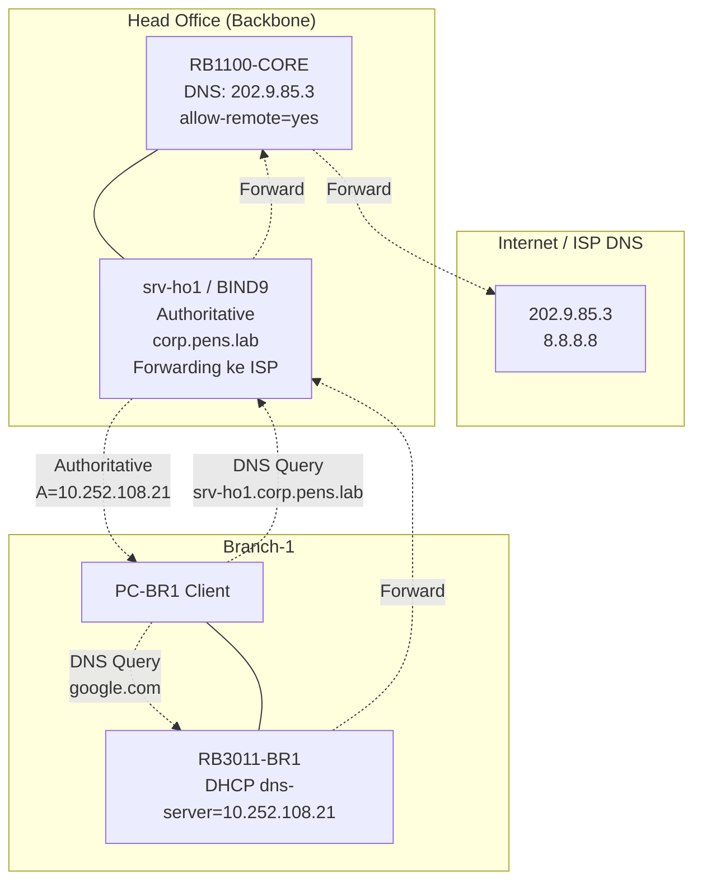

# MINGGU_3_DNS
**Topik:** DNS Services (BIND9 Forward & Reverse Zones)  
**Tema Besar:** Head Office sebagai DNS Authority untuk Enterprise Network [cite:1][cite:18]

---

## 1. Tujuan Pembelajaran

Setelah praktikum Minggu 3, mahasiswa mampu: [cite:1][cite:18]  
- Menginstall dan mengkonfigurasi BIND9 sebagai **authoritative DNS server** di server Head Office.  
- Membuat **forward zone** dan **reverse zone** untuk domain enterprise internal.  
- Mengkonfigurasi **forwarding** dari branch ke DNS pusat dan upstream ke public DNS.  
- Menguji resolusi nama antar-branch dan dari client ke service di Head Office.  

---

## 2. Konteks Skenario Enterprise (Lanjutan Minggu 1-2)

DNS Authority di **Head Office** (`srv-ho1` atau `srv-dns-core`): [cite:1][cite:14]  

- **Domain enterprise:** `corp.pens.lab` (internal).  
- **Forward zone:** semua hostname di backbone dan branch (proxmox.corp.pens.lab, srv-ho1.corp.pens.lab, dll).  
- **Reverse zone:** PTR records untuk subnet backbone (10.252.108.0/24) dan VLAN server (10.252.10.0/24).  
- **Forwarding:** untuk domain eksternal (.com, .org), forward ke DNS pusat RB1100-CORE → ISP DNS.  

Branch server (RB3011 atau VM nanti): akan jadi **caching forwarder** yang forward ke DNS HQ. [cite:1][cite:6]  

---

## 3. Topologi DNS Hierarchy



**Flow DNS Query:**  
1. PC-BR1 query `srv-ho1.corp.pens.lab` → RB3011 DHCP dns-server → BIND9 di srv-ho1 → **Authoritative Answer**. [cite:1]  
2. PC-BR1 query `google.com` → BIND9 srv-ho1 → forward ke RB1100 → ISP DNS. [cite:1]  

---

## 4. Lingkungan Praktikum

### 4.1 Asumsi Perangkat

Per kelompok: [cite:11][cite:14]  
- `srv-ho1` (Ubuntu Server dari Minggu 2, IP 10.252.108.21 + VLAN).  
- PC-BR1 (client di Branch-1, 192.168.11.10) untuk testing.  
- RB3011-BR1 dan RB1100-CORE sudah berjalan (DNS resolver aktif). [cite:2][cite:6]  

---

## 5. Langkah Praktikum

### 5.1 Install BIND9 di srv-ho1

SSH ke `srv-ho1` (10.252.108.21):  

```bash
sudo apt update
sudo apt install -y bind9 bind9utils bind9-doc dnsutils
sudo systemctl enable --now bind9
sudo systemctl status bind9
```

### 5.2 Konfigurasi BIND9 Main File (/etc/bind/named.conf.local)

```bash
sudo nano /etc/bind/named.conf.local
```

Tambahkan zone definitions:  

```bash
// Forward zone corp.pens.lab
zone "corp.pens.lab" {
    type master;
    file "/etc/bind/db.corp.pens.lab";
};

// Reverse zone backbone 10.252.108.0/24
zone "108.252.10.in-addr.arpa" {
    type master;
    file "/etc/bind/db.108.252.10";
};

// Forwarding untuk domain eksternal
options {
    forwarders {
        202.9.85.3;
        8.8.8.8;
    };
    forward only;
};
```

### 5.3 Buat Forward Zone File (/etc/bind/db.corp.pens.lab)

```bash
sudo nano /etc/bind/db.corp.pens.lab
```

Isi (copy-paste): [cite:1]  

```bash
$TTL    604800
@       IN      SOA     srv-ho1.corp.pens.lab. root.corp.pens.lab. (
                              2         ; Serial
                         604800         ; Refresh
                          86400         ; Retry
                        2419200         ; Expire
                         604800 )       ; Negative Cache TTL
;
@       IN      NS      srv-ho1.corp.pens.lab.
@       IN      A       10.252.108.21
@       IN      AAAA    ::1

srv-ho1 IN      A       10.252.108.21
rb1100-core IN  A       10.252.108.254
rb3011-br1 IN   A       10.252.108.11
pc-br1 IN       A       192.168.11.10
proxmox IN      A       10.252.108.21
grafana IN      A       10.252.10.21     ; VLAN HQ services
```

### 5.4 Buat Reverse Zone File (/etc/bind/db.108.252.10)

```bash
sudo nano /etc/bind/db.108.252.10
```

Isi: [cite:1]  

```bash
$TTL    604800
@       IN      SOA     srv-ho1.corp.pens.lab. root.corp.pens.lab. (
                              2         ; Serial
                         604800         ; Refresh
                          86400         ; Retry
                        2419200         ; Expire
                         604800 )       ; Negative Cache TTL
;
@       IN      NS      srv-ho1.
21      IN      PTR     srv-ho1.corp.pens.lab.
254     IN      PTR     rb1100-core.corp.pens.lab.
11      IN      PTR     rb3011-br1.corp.pens.lab.
```

### 5.5 Set Permissions dan Restart BIND9

```bash
sudo chown -R bind:bind /etc/bind/
sudo chmod -R 644 /etc/bind/db.*
sudo rndc reload corp.pens.lab
sudo rndc reload 108.252.10.in-addr.arpa
sudo systemctl restart bind9
sudo systemctl status bind9
```

### 5.6 Testing DNS Resolution

Dari `srv-ho1` sendiri:  

```bash
dig srv-ho1.corp.pens.lab @127.0.0.1
dig 10.252.108.21 @127.0.0.1
dig google.com @127.0.0.1
```

**Harusnya:**  
- `srv-ho1.corp.pens.lab` → 10.252.108.21 (authoritative).  
- `10.252.108.21` → srv-ho1.corp.pens.lab (reverse).  
- `google.com` → forwarded ke ISP DNS. [cite:1]  

### 5.7 Testing dari Client PC-BR1

1. Set DNS di PC-BR1 ke 10.252.108.21 (atau via DHCP RB3011).  

2. Test:  

```bash
nslookup srv-ho1.corp.pens.lab 10.252.108.21
nslookup proxmox.corp.pens.lab 10.252.108.21
nslookup 10.252.108.254 10.252.108.21
nslookup google.com 10.252.108.21
```

Semua query harus **sukses**! [cite:1]  

---

## 6. Tugas Praktikum

### 6.1 Tugas Konfigurasi

Untuk setiap kelompok:  

1. Konfigurasi BIND9 authoritative di `srv-ho1` seperti di atas.  
2. **Tambahkan** minimal 3 record baru di forward zone sesuai kelompok Anda:  
   - Hostname untuk PC-BR1 kelompok Anda.  
   - Hostname untuk RB3011-BR1 kelompok Anda.  
   - Hostname untuk service masa depan (mis. `grafana-k01.corp.pens.lab`).  
3. Update reverse zone untuk IP kelompok Anda (minimal 2 PTR record).  
4. Test resolusi dari PC-BR1 ke semua hostname internal + eksternal.  

### 6.2 Pertanyaan Teori

Jawab singkat (2–4 kalimat):  

1. Apa perbedaan **authoritative DNS server** (BIND9 srv-ho1) dengan **forwarding DNS server** (RB1100-CORE)? [cite:1]  
2. Mengapa reverse DNS (PTR records) penting untuk troubleshooting dan monitoring enterprise network? Berikan contoh kasus. [cite:1][cite:7]  
3. Jelaskan fungsi parameter `forward only` di BIND9. Apa bedanya dengan `forward first`?  
4. Jika PC-BR1 query `srv-ho1.corp.pens.lab` dan gagal, langkah troubleshooting apa yang Anda lakukan pertama kali?  

### 6.3 Pertanyaan Setelah Praktik (Refleksi)

1. Bagian mana yang paling sulit: syntax zone file BIND9, permission files, atau testing dengan dig/nslookup?  
2. Bagaimana desain DNS hierarchy ini (HO authoritative + branch forwarder) membantu skalabilitas saat ada 10 branch aktif? [cite:11][cite:12]  
3. Jika nanti monitoring Grafana (Minggu 7) perlu resolve hostname otomatis dari log, bagaimana BIND9 ini membantu? [cite:7]  

---

## 7. Output yang Harus Dikumpulkan

Laporan per kelompok (PDF/Markdown): [cite:1][cite:18]  

1. Isi file:  
   - `/etc/bind/named.conf.local`.  
   - `/etc/bind/db.corp.pens.lab` (dengan tambahan 3 record kelompok).  
   - `/etc/bind/db.108.252.10` (dengan tambahan PTR).  

2. Screenshot/hasil testing:  
   - `dig srv-ho1.corp.pens.lab @127.0.0.1` dari srv-ho1.  
   - `nslookup` dari PC-BR1 ke 3 hostname internal + 1 eksternal.  
   - `systemctl status bind9`.  

3. Jawaban pertanyaan teori (6.2) dan refleksi (6.3).  

---

## 8. Checklist Asisten/Instruktur

- [ ] BIND9 running dan listen di 10.252.108.21:53. [cite:1]  
- [ ] Forward zone `corp.pens.lab` authoritative (minimal 6 record termasuk tambahan kelompok).  
- [ ] Reverse zone backbone berfungsi (PTR untuk minimal 4 IP).  
- [ ] Forwarding ke ISP DNS bekerja (query google.com sukses).  
- [ ] Client PC-BR1 dapat resolve hostname internal dari BIND9.  
- [ ] Laporan lengkap dengan file config dan hasil testing. [cite:1][cite:18]  

---

**Troubleshooting Cepat:**  
| Masalah | Solusi |  
|---------|--------|  
| `dig` no answer | Cek `rndc reload`, restart BIND9 |  
| Permission denied | `chown bind:bind /etc/bind/db.*` |  
| Client tidak resolve | Cek DHCP dns-server atau `/etc/resolv.conf` di client |  
| Forwarding gagal | Cek `forwarders` di named.conf.options |  

---

