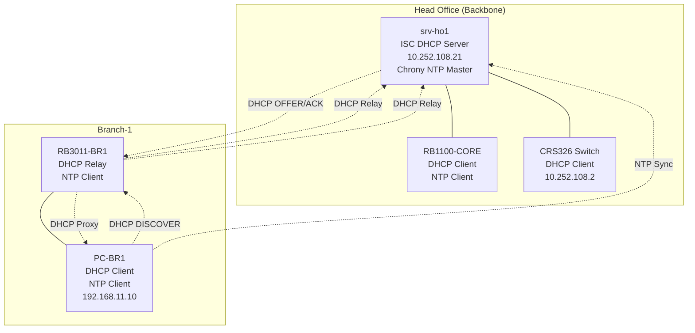

# MINGGU_4_DHCP_NTP
**Topik:** DHCP Services (ISC DHCP) & NTP (Chrony Time Sync)  
**Tema :** Head Office menyediakan DHCP Pusat & NTP Master untuk Enterprise [cite:18]

---

## 1. Tujuan Pembelajaran

Setelah praktikum Minggu 4, mahasiswa mampu: [cite:18]  
- Mengkonfigurasi **ISC DHCP Server** di server Head Office untuk melayani subnet backbone.  
- Mengatur **DHCP pool**, lease time, dan reservation berdasarkan MAC address.  
- Menginstall **Chrony** sebagai NTP master dan melakukan time sync antar server/branch.  
- Mengintegrasikan DHCP dengan DNS BIND9 dari Minggu 3 untuk IP dinamis dengan hostname.  

---

## 2. Konteks Skenario Enterprise (Lanjutan Minggu 1-3)

**DHCP di Head Office** (`srv-ho1` atau `srv-dhcp-core`): [cite:6][cite:18]  
- Melayani subnet backbone 10.252.108.0/24 (server farm, PC management).  
- DHCP relay dari branch (RB3011) ke DHCP pusat.  
- **Reservation**: IP tetap untuk server kritis berdasarkan MAC.  

**NTP di Head Office** (`srv-ntp-core`):  
- Time source untuk semua router MikroTik, server Ubuntu, dan client PC.  
- Sinkronisasi akurat untuk logging, monitoring (Minggu 7), dan certificate SSL (Minggu 5).  

Integrasi: DHCP memberikan DNS server = 10.252.108.21 (BIND9 Minggu 3). [cite:1]  

---

## 3. Topologi DHCP & NTP



**Flow DHCP:** PC-BR1 → RB3011 relay → srv-ho1 DHCP → RB3011 proxy → PC-BR1 (IP + DNS). [cite:6]  

---

## 4. Lingkungan Praktikum

Per kelompok: [cite:11][cite:14]  
- `srv-ho1` (Ubuntu Server, BIND9 aktif dari Minggu 3).  
- RB3011-BR1 dan PC-BR1 (Branch-1).  
- Akses ke RB1100-CORE untuk testing DHCP client.  

---

## 5. Langkah Praktikum

### 5.1 Install ISC DHCP Server di srv-ho1

```bash
sudo apt update
sudo apt install -y isc-dhcp-server chrony ntpdate
sudo systemctl enable --now isc-dhcp-server
sudo systemctl status isc-dhcp-server
```

### 5.2 Konfigurasi DHCP Interface

Edit `/etc/default/isc-dhcp-server`:  

```bash
INTERFACESv4="br0"  # atau enp1s0/bond0 sesuai Minggu 2
```

### 5.3 Konfigurasi DHCP Server (/etc/dhcp/dhcpd.conf)

```bash
sudo nano /etc/dhcp/dhcpd.conf
```

Tambahkan konfigurasi di akhir file:  

```bash
# Global options
default-lease-time 600;
max-lease-time 7200;
authoritative;

# Subnet backbone 10.252.108.0/24 (server farm)
subnet 10.252.108.0 netmask 255.255.255.0 {
    range 10.252.108.100 10.252.108.200;
    option routers 10.252.108.254;
    option domain-name-servers 10.252.108.21, 202.9.85.3;
    option domain-name "corp.pens.lab";
    option domain-search "corp.pens.lab";
    
    # Reservation untuk CRS326
    host crs326 {
        hardware ethernet AA:BB:CC:DD:EE:FF;  # Ganti MAC asli CRS326
        fixed-address 10.252.108.2;
    }
    
    # Reservation untuk server lain (contoh)
    host proxmox {
        hardware ethernet 08:00:27:XX:XX:XX;  # Ganti MAC Proxmox
        fixed-address 10.252.108.21;
    }
}
```

**Cara dapat MAC address:**  
- Dari PC/VM: `ip link show`.  
- Dari MikroTik: `/interface print`.  

### 5.4 Restart DHCP Server

```bash
sudo systemctl restart isc-dhcp-server
sudo systemctl status isc-dhcp-server
sudo tail -f /var/log/syslog | grep dhcp
```

### 5.5 Testing DHCP di Backbone

1. **Release IP di CRS326 atau PC lain di backbone:**  
   - MikroTik: `/ip dhcp-client release [find]`.  
   - Ubuntu: `sudo dhclient -r br0 && sudo dhclient br0`.  

2. **Request IP baru:**  
   - MikroTik/PC harus dapat IP dari pool 10.252.108.100–200.  
   - DNS otomatis = 10.252.108.21 (BIND9).  
   - Test: `nslookup srv-ho1.corp.pens.lab` langsung dari client DHCP.  

3. **Cek reservation:** pastikan CRS326 dapat IP fixed 10.252.108.2.  

### 5.6 Konfigurasi DHCP Relay di RB3011-BRANCH-1

Masuk ke RB3011:  

```bash
/ip dhcp-relay add name=relay-br1 interface=ether2 dhcp-server=10.252.108.21
/interface list member add list=DHCP interface=ether2
/ip dhcp-server network set 0 dns-server=10.252.108.21 domain=corp.pens.lab
```

Test dari PC-BR1:  
- Release DHCP: `sudo dhclient -r && sudo dhclient`.  
- Harus dapat IP 192.168.11.x dari RB3011 lokal, tapi DNS = 10.252.108.21.  
- Test resolve `srv-ho1.corp.pens.lab`. [cite:6]  

---

## 6. NTP Configuration (Chrony)

### 6.1 Konfigurasi Chrony NTP Master di srv-ho1

```bash
sudo nano /etc/chrony/chrony.conf
```

Tambahkan/edit:  

```
# NTP Master (allow clients)
allow 10.252.108.0/24
allow 192.168.11.0/24
local stratum 10

# Sinkron dengan NTP public (upstream)
server 0.id.pool.ntp.org iburst
server 1.id.pool.ntp.org iburst

# Log
logdir /var/log/chrony
```

Restart:  

```bash
sudo systemctl restart chronyd
sudo chronyc sources
sudo chronyc tracking
```

### 6.2 Testing NTP Sync dari Client

**Di PC-BR1 atau RB3011:**  

```bash
# Install chrony
sudo apt install chrony

# Edit /etc/chrony/chrony.conf
server 10.252.108.21 iburst

# Restart & test
sudo systemctl restart chronyd
chronyc sources
chronyc tracking
```

**Di MikroTik RB3011:**  

```bash
/system ntp client set enabled=yes servers=10.252.108.21
/system ntp client print
```

Cek time sync: `date` di semua device harus hampir sama (±1 detik).  

---

## 7. Tugas Praktikum

### 7.1 Tugas Konfigurasi

1. Konfigurasi ISC DHCP di `srv-ho1` untuk subnet backbone + minimal **2 reservation** (1 untuk CRS326, 1 untuk device kelompok).  
2. Aktifkan DHCP relay di RB3011-BRANCH-1 ke srv-ho1.  
3. Konfigurasi Chrony NTP master di srv-ho1 dan client di PC-BR1 + RB3011.  
4. Test: PC baru dapat IP via DHCP, resolve DNS BIND9, dan sync NTP.  

### 7.2 Pertanyaan Teori

1. Apa perbedaan **DHCP pool** dengan **fixed reservation**? Kapan menggunakan masing-masing di enterprise?  
2. Jelaskan alur DHCP **relay agent** (RB3011) vs **proxy DHCP**. Mengapa relay lebih scalable untuk multi-branch? [cite:6]  
3. Mengapa **NTP sync** kritis untuk monitoring (Prometheus/Grafana Minggu 7) dan certificate validation (SSL Minggu 5)?  
4. Jika client dapat IP tapi tidak resolve DNS, langkah troubleshooting apa yang Anda lakukan?  

### 7.3 Pertanyaan Setelah Praktik

1. Bagian mana yang paling ribet: syntax dhcpd.conf, dapat MAC address, atau relay di MikroTik?  
2. Bagaimana integrasi DHCP → DNS → NTP ini mempersiapkan infrastruktur untuk container/K8s (Minggu 9-10)?  
3. Jika ada 10 branch, apakah tetap pakai 1 DHCP pusat atau per branch? Pertimbangan pro/kontra. [cite:11]  

---

## 8. Output yang Harus Dikumpulkan

Laporan per kelompok: [cite:18]  

1. File konfigurasi:  
   - `/etc/dhcp/dhcpd.conf` (bagian subnet + reservation).  
   - `/etc/default/isc-dhcp-server`.  
   - `/etc/chrony/chrony.conf`.  

2. Screenshot:  
   - `systemctl status isc-dhcp-server` dan `chronyd`.  
   - Lease DHCP: `cat /var/lib/dhcp/dhcpd.leases`.  
   - `chronyc sources` dan `chronyc tracking` di client.  
   - PC baru dapat IP + test `nslookup` + `date`.  

3. Jawaban pertanyaan.  

---

## 9. Checklist Asisten/Instruktur

- [ ] ISC DHCP running, melayani backbone pool.  
- [ ] Minimal 2 reservation berfungsi (fixed IP berdasarkan MAC).  
- [ ] DHCP relay RB3011 → srv-ho1 → client dapat DNS BIND9.  
- [ ] Chrony NTP sync sukses (offset <1s) di minimal 2 client.  
- [ ] Laporan lengkap.  

**Troubleshooting:**  
| Masalah | Solusi |  
|---------|--------|  
| No lease | Cek INTERFACESv4, restart service |  
| Relay gagal | Cek `/ip dhcp-relay` di MikroTik |  
| NTP tidak sync | Cek `allow` di chrony.conf master |  

---


