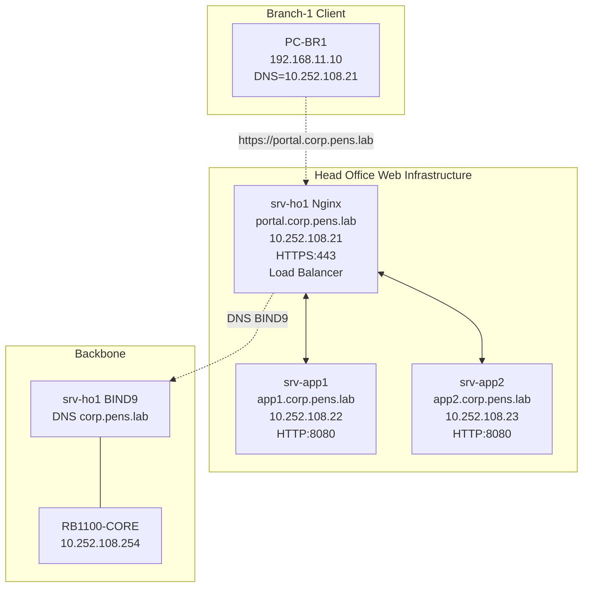

# MINGGU_5_WEB.md
**Topik:** Web Services & Proxy (Nginx Reverse Proxy, SSL, Load Balancing)  
**Tema Besar:** Head Office Web Portal Enterprise dengan High Availability [cite:18]

---

## 1. Tujuan Pembelajaran

Setelah praktikum Minggu 5, mahasiswa mampu: [cite:18]  
- Menginstall **Nginx** sebagai reverse proxy di server Head Office.  
- Mengkonfigurasi **SSL/TLS** dengan self-signed certificate untuk HTTPS.  
- Membuat **load balancing** sederhana ke beberapa backend services (VM/PC).  
- Mengakses web portal enterprise dari branch via DNS BIND9 (Minggu 3).  

---

## 2. Konteks Skenario Enterprise (Lanjutan Minggu 1-4)

**Web Infrastructure di Head Office**: [cite:12][cite:14][cite:18]  
- **portal.corp.pens.lab** → Nginx reverse proxy di `srv-ho1` (10.252.108.21).  
- Backend services (simulasi):  
  - `app1.corp.pens.lab` (10.252.108.22) → aplikasi utama.  
  - `app2.corp.pens.lab` (10.252.108.23) → aplikasi backup/redundansi.  
- **Load balancing**: traffic dibagi ke app1 dan app2.  
- **SSL termination**: Nginx handle HTTPS, backend plain HTTP.  

Akses dari Branch-1 PC: `https://portal.corp.pens.lab` → resolve via BIND9 → Nginx → load balance ke app1/app2. [cite:1]  

---

## 3. Topologi Web Services



**Flow Request:** PC-BR1 → DNS BIND9 → Nginx HTTPS → load balance round-robin ke app1/app2 HTTP.  

---

## 4. Lingkungan Praktikum

Per kelompok: [cite:11][cite:14]  
- `srv-ho1` (Ubuntu, BIND9 + DHCP aktif).  
- 2 PC/VM tambahan sebagai backend `app1` dan `app2` (IP 10.252.108.22/23 atau simulasi).  
- PC-BR1 untuk testing dari branch.  

**Catatan:** Jika hanya 1 PC fisik, gunakan **container Docker** untuk simulasi app1/app2 (preview Minggu 9), atau VM ringan di srv-ho1.  

---

## 5. Langkah Praktikum

### 5.1 Install Nginx di srv-ho1

```bash
sudo apt update
sudo apt install -y nginx apache2-utils  # apache2-utils untuk httperf
sudo systemctl enable --now nginx
sudo systemctl status nginx
```

### 5.2 Buat Backend Services Sederhana (Simulasi app1 & app2)

**Di srv-app1 (10.252.108.22) atau container/VM1:**  

```bash
# Install simple HTTP server
sudo apt install -y apache2
sudo systemctl enable --now apache2

# Custom index untuk identifikasi
echo "<h1>APP1 Server - 10.252.108.22</h1>" | sudo tee /var/www/html/index.html

# Ubah port ke 8080
sudo nano /etc/apache2/ports.conf
Listen 8080

sudo systemctl restart apache2
```

**Di srv-app2 (10.252.108.23) atau container/VM2:** sama, tapi ganti index.html:  

```bash
echo "<h1>APP2 Server - 10.252.108.23</h1>" | sudo tee /var/www/html/index.html
```

Test dari srv-ho1:  

```bash
curl http://10.252.108.22:8080
curl http://10.252.108.23:8080
```

### 5.3 Konfigurasi Nginx Reverse Proxy + Load Balancing

Buat virtual host baru:  

```bash
sudo nano /etc/nginx/sites-available/portal.corp.pens.lab
```

Isi konfigurasi:  

```nginx
upstream backend_apps {
    least_conn;  # atau round_robin
    server 10.252.108.22:8080 weight=2 max_fails=3 fail_timeout=30s;
    server 10.252.108.23:8080 weight=1 max_fails=3 fail_timeout=30s;
}

server {
    listen 80;
    listen [::]:80;
    server_name portal.corp.pens.lab;

    # Redirect HTTP ke HTTPS
    return 301 https://$server_name$request_uri;
}

server {
    listen 443 ssl http2;
    listen [::]:443 ssl http2;
    server_name portal.corp.pens.lab;

    # SSL self-signed (buat dulu)
    ssl_certificate /etc/nginx/ssl/portal.crt;
    ssl_certificate_key /etc/nginx/ssl/portal.key;

    # Security headers
    add_header Strict-Transport-Security "max-age=31536000" always;

    location / {
        proxy_pass http://backend_apps;
        proxy_set_header Host $host;
        proxy_set_header X-Real-IP $remote_addr;
        proxy_set_header X-Forwarded-For $proxy_add_x_forwarded_for;
        proxy_set_header X-Forwarded-Proto $scheme;
        
        # Health check
        health_check interval=10 fails=3 passes=2 uri=/;
    }
}
```

### 5.4 Generate Self-Signed SSL Certificate

```bash
sudo mkdir -p /etc/nginx/ssl
sudo openssl req -x509 -nodes -days 365 -newkey rsa:2048 \
  -keyout /etc/nginx/ssl/portal.key \
  -out /etc/nginx/ssl/portal.crt \
  -subj "/C=ID/ST=Jawa Timur/L=Surabaya/O=PENS/CN=portal.corp.pens.lab"
```

### 5.5 Aktifkan Site dan Test Nginx

```bash
sudo ln -s /etc/nginx/sites-available/portal.corp.pens.lab /etc/nginx/sites-enabled/
sudo nginx -t
sudo systemctl reload nginx
```

### 5.6 Testing dari Branch Client (PC-BR1)

1. **Pastikan DNS resolve:**  

```bash
nslookup portal.corp.pens.lab 10.252.108.21
# Harus return 10.252.108.21
```

2. **Test HTTP redirect:**  

```bash
curl -I http://portal.corp.pens.lab
# Harus 301 redirect ke HTTPS
```

3. **Test HTTPS load balancing (10x request):**  

```bash
for i in {1..10}; do curl -k https://portal.corp.pens.lab/; echo "---"; done
```

**Hasil expected:**  
- Request bergantian ke APP1 dan APP2 (karena weight 2:1).  
- Jika app1 down, semua traffic ke app2.  

4. **Browser test:** buka `https://portal.corp.pens.lab` (abaikan SSL warning).  

---

## 6. Tugas Praktikum

### 6.1 Tugas Konfigurasi

1. Konfigurasi Nginx reverse proxy di `srv-ho1` seperti di atas.  
2. **Tambahkan** minimal 1 backend tambahan (app3) dengan weight berbeda.  
3. Update BIND9 (Minggu 3) dengan record `portal.corp.pens.lab A 10.252.108.21`.  
4. Test load balancing: 20 request, catat distribusi traffic antar backend.  
5. **Simulasi failover**: matikan 1 backend, test semua traffic ke yang tersisa.  

### 6.2 Pertanyaan Teori

1. Apa fungsi `least_conn` vs `round_robin` di upstream Nginx? Kapan menggunakan masing-masing?  
2. Jelaskan **SSL termination** di reverse proxy. Keuntungan dan risiko keamanannya.  
3. Mengapa Nginx lebih cocok sebagai reverse proxy/load balancer dibanding Apache di skenario high-traffic enterprise?  
4. Bagaimana `health_check` di Nginx membantu high availability? Apa parameter `max_fails` dan `fail_timeout`?  

### 6.3 Pertanyaan Setelah Praktik

1. Load balancing bekerja sesuai weight? Berapa persentase traffic ke app1 vs app2?  
2. Saat 1 backend down, berapa lama Nginx mendeteksi dan switch traffic?  
3. Bagaimana integrasi web ini dengan monitoring Grafana (Minggu 7) untuk track response time per backend?  

---

## 7. Output yang Harus Dikumpulkan

Laporan per kelompok: [cite:18]  

1. File konfigurasi:  
   - `/etc/nginx/sites-available/portal.corp.pens.lab`.  
   - BIND9 record tambahan untuk portal.corp.pens.lab.  

2. Screenshot:  
   - `nginx -t` success.  
   - Hasil 20x `curl` menunjukkan load balancing.  
   - Browser akses HTTPS dari PC-BR1.  
   - Test failover (backend down).  

3. Jawaban pertanyaan + log distribusi traffic (app1:app2:app3).  

---

## 8. Checklist Asisten/Instruktur

- [ ] Nginx running, HTTPS portal.corp.pens.lab accessible.  
- [ ] DNS BIND9 resolve portal.corp.pens.lab → 10.252.108.21.  
- [ ] Load balancing ke minimal 2 backend, distribusi sesuai weight.  
- [ ] Failover test: traffic switch saat 1 backend down.  
- [ ] SSL certificate valid (self-signed OK).  
- [ ] Laporan lengkap.  

**Troubleshooting:**  
| Masalah | Solusi |  
|---------|--------|  
| 502 Bad Gateway | Cek backend HTTP:8080 alive |  
| DNS tidak resolve | Reload BIND9 zone |  
| SSL error | Cek certificate path di nginx.conf |  
| Load balance tidak bekerja | Cek `least_conn` dan health_check |  

---

