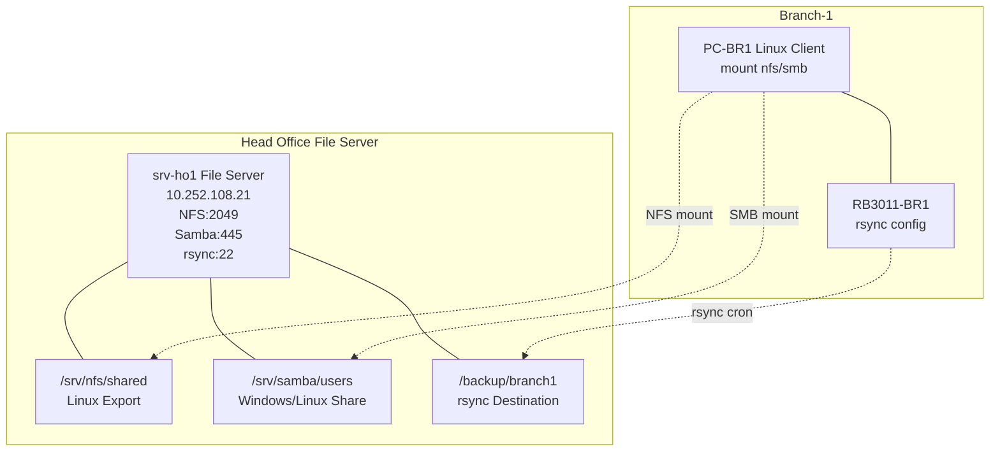

# MINGGU_6_FILE_SERVICES
**Topik:** File Services & Storage (NFS, Samba, rsync Backup Automation)  
**Tema Besar:** Centralized File Storage Head Office untuk Semua Branch [cite:18]

---

## 1. Tujuan Pembelajaran

Setelah praktikum Minggu 6, mahasiswa mampu: [cite:18]  
- Mengkonfigurasi **NFS server** di Head Office untuk shared storage antar Linux servers.  
- Menginstall **Samba** untuk file sharing Windows/Linux clients di branch.  
- Mengatur **rsync** dengan cronjob untuk backup otomatis dari branch ke Head Office.  
- Mengakses shared storage dari PC client branch via CIFS/SMB.  

---

## 2. Konteks Skenario Enterprise (Lanjutan Minggu 1-5)

**Central File Server di Head Office** (`srv-ho1` atau `srv-file-core`): [cite:12][cite:14][cite:18]  
- **NFS**: untuk Linux servers (Proxmox VM storage, container data).  
- **Samba/CIFS**: untuk Windows clients di branch (dokumen user, shared drive).  
- **rsync backup**: otomatis backup config/log dari branch router/server setiap jam.  

Storage paths:  
- `/srv/nfs/shared` → NFS export untuk Linux.  
- `/srv/samba/users` → Samba share untuk clients.  
- `/backup/branch1` → rsync destination dari Branch-1.  

Akses dari Branch-1: `mount //fileserver.corp.pens.lab/users` atau `rsync -avz config/ fileserver:/backup/`. [cite:1]  

---

## 3. Topologi File Services



**Flow Akses:** Branch PC → DNS BIND9 → fileserver.corp.pens.lab → NFS/Samba/rsync.  

---

## 4. Lingkungan Praktikum

Per kelompok: [cite:11][cite:14]  
- `srv-ho1` (Ubuntu Server, BIND9, Nginx aktif).  
- PC-BR1 (Linux client di Branch-1).  
- Akses SSH ke RB3011 untuk rsync testing.  

---

## 5. Langkah Praktikum

### 5.1 Buat Direktori Storage di srv-ho1

```bash
sudo mkdir -p /srv/nfs/shared /srv/samba/{users,public} /backup/branch1
sudo chown nobody:nogroup /srv/nfs/shared
sudo chmod 777 /srv/nfs/shared  # Development only!
sudo chown -R nobody:nogroup /srv/samba/public
sudo chmod -R 777 /srv/samba/public
```

Test write: `echo "test file" | sudo tee /srv/nfs/shared/test.txt`

### 5.2 Konfigurasi NFS Server

1. Install NFS:  

```bash
sudo apt install -y nfs-kernel-server
```

2. Edit `/etc/exports`:  

```bash
sudo nano /etc/exports
```

Tambahkan:  

```
/srv/nfs/shared 10.252.108.0/24(rw,sync,no_subtree_check,no_root_squash)
/srv/nfs/shared 192.168.11.0/24(ro,sync,no_subtree_check)
```

3. Export dan restart:  

```bash
sudo exportfs -a
sudo systemctl restart nfs-kernel-server
sudo exportfs -v
```

### 5.3 Konfigurasi Samba Server

1. Install Samba:  

```bash
sudo apt install -y samba smbclient cifs-utils
```

2. Basic config `/etc/samba/smb.conf`:  

```bash
sudo nano /etc/samba/smb.conf
```

Tambahkan di akhir `[global]` dan shares:  

```
[global]
   workgroup = PENS
   server string = HO File Server
   security = user
   map to guest = bad user

[public]
   path = /srv/samba/public
   browseable = yes
   writable = yes
   guest ok = yes
   read only = no
   create mask = 0777

[users]
   path = /srv/samba/users
   browseable = yes
   writable = yes
   valid users = @nogroup
   create mask = 0664
   directory mask = 0775
```

3. Test config dan restart:  

```bash
sudo testparm
sudo systemctl restart smbd nmbd
sudo smbpasswd -a nobody  # password: pens123
```

### 5.4 Testing NFS dari PC-BR1

Di PC-BR1 (Linux client):  

```bash
sudo apt install -y nfs-common
showmount -e 10.252.108.21
sudo mkdir /mnt/nfs
sudo mount -t nfs 10.252.108.21:/srv/nfs/shared /mnt/nfs
ls /mnt/nfs
echo "branch1 test" > /mnt/nfs/branch1.txt
umount /mnt/nfs
```

### 5.5 Testing Samba dari PC-BR1

```bash
# List shares
smbclient -L //10.252.108.21 -N

# Mount CIFS
sudo mkdir /mnt/smb
sudo mount -t cifs //10.252.108.21/public /mnt/smb -o guest
ls /mnt/smb
echo "samba test" > /mnt/smb/smb-test.txt
umount /mnt/smb

# Test authenticated
sudo mount -t cifs //10.252.108.21/users /mnt/smb -o username=nobody,password=pens123
```

### 5.6 rsync Backup Automation

1. **Test rsync manual** dari RB3011 ke srv-ho1 (via SSH key atau passwordless):  

Di RB3011 (export config):  

```bash
# Backup export
/export compact file=backup-branch1.rsc
```

Di PC-BR1 (simulasi rsync):  

```bash
rsync -avz --progress /etc/ 10.252.108.21:/backup/branch1/etc-backup/
```

2. **Cronjob otomatis** di PC-BR1 atau script:  

```bash
sudo crontab -e
```

Tambahkan (backup setiap jam):  

```
0 * * * * rsync -avz --delete /etc/ root@10.252.108.21:/backup/branch1/etc-`date +\%Y\%m\%d`/ >> /var/log/backup.log 2>&1
```

Test cron: `sudo run-parts --test /etc/cron.hourly` (jika script di hourly).  

---

## 6. Tugas Praktikum

### 6.1 Tugas Konfigurasi

1. Konfigurasi NFS + Samba di `srv-ho1` seperti di atas.  
2. **Tambahkan** minimal 1 share Samba baru (`backup-kelompok`) dengan permission khusus.  
3. Buat **cronjob rsync** untuk backup folder `/etc/` dari PC-BR1 ke srv-ho1 setiap 30 menit.  
4. Test mount NFS/Samba dari PC-BR1, write file, dan jalankan rsync manual.  

### 6.2 Pertanyaan Teori

1. Apa perbedaan **NFS** vs **Samba/CIFS**? Kapan menggunakan masing-masing di mixed environment (Linux+Windows)?  
2. Jelaskan parameter NFS `no_root_squash`. Risiko keamanannya apa?  
3. Mengapa rsync dengan `--delete` lebih aman untuk backup mirror dibandingkan copy biasa?  
4. Bagaimana integrasi file services ini dengan container storage (Minggu 9 Docker volumes)?  

### 6.3 Pertanyaan Setelah Praktik

1. Mount NFS/Samba sukses? Bisa write/read dari branch?  
2. rsync cron berjalan? Cek isi `/backup/branch1` di srv-ho1.  
3. Jika permission error di Samba, langkah debug apa yang dilakukan?  

---

## 7. Output yang Harus Dikumpulkan

Laporan: [cite:18]  

1. File konfigurasi:  
   - `/etc/exports` (NFS).  
   - `/etc/samba/smb.conf` (bagian shares).  
   - Cronjob entry.  

2. Screenshot:  
   - `showmount`, `smbclient -L`.  
   - Mount success NFS/Samba di PC-BR1.  
   - Isi `/backup/branch1` setelah rsync.  
   - Log cron backup.  

3. Jawaban pertanyaan.  

---

## 8. Checklist Asisten

- [ ] NFS export accessible dari branch (rw backbone, ro branch).  
- [ ] Samba shares public/users mountable dari PC-BR1.  
- [ ] rsync backup berhasil, folder `/backup/branch1` ada data.  
- [ ] Cronjob syntax benar dan test run.  
- [ ] Laporan lengkap.  

**Troubleshooting:**  
| Masalah | Solusi |  
|---------|--------|  
| NFS mount fail | `exportfs -a`, cek firewall ufw |  
| Samba permission | `testparm`, smbpasswd |  
| rsync SSH error | Setup SSH key passwordless |  

---

