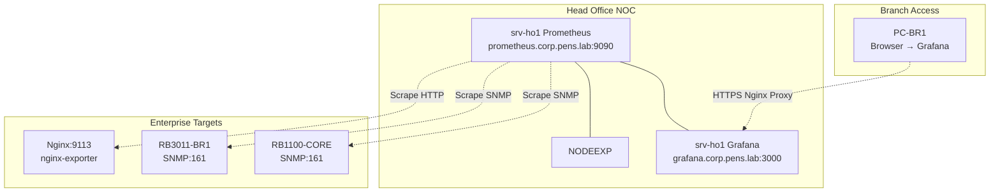

# MINGGU_7_MONITORING.md
**Topik:** Monitoring & Observability (Prometheus, node_exporter, Grafana)  
**Tema Besar:** NOC Head Office memonitor seluruh Enterprise Network [cite:7][cite:18]

---

## 1. Tujuan Pembelajaran

Setelah praktikum Minggu 7, mahasiswa mampu: [cite:7][cite:18]  
- Menginstall **Prometheus** dan **node_exporter** di Head Office untuk monitoring Linux servers.  
- Mengkonfigurasi **Grafana** dengan dashboard untuk visualisasi metrics.  
- Menambahkan monitoring **MikroTik SNMP** untuk router enterprise.  
- Menganalisis health backbone, branch, dan services dari Grafana dashboard.  

---

## 2. Konteks Skenario Enterprise (Lanjutan Minggu 1-6)

**NOC Monitoring Stack di Head Office** (`srv-ho1` atau `srv-mon-core`): [cite:5][cite:7][cite:14]  
- **Prometheus**: time-series database, scrape metrics dari node_exporter (Linux) dan SNMP (MikroTik).  
- **Grafana**: visualisasi dashboard CPU, memory, network traffic, uptime.  
- **Monitoring targets**:  
  - srv-ho1 sendiri (node_exporter).  
  - RB1100-CORE, RB3011-BR1 (SNMP).  
  - Nginx (via exporter), BIND9, DHCP services.  

Dashboard: `grafana.corp.pens.lab` → akses dari branch PC via reverse proxy Nginx (Minggu 5). [cite:1]  

---

## 3. Topologi Monitoring Stack



**Flow:** Prometheus scrape → store metrics → Grafana query → dashboard real-time.  

---

## 4. Lingkungan Praktikum

Per kelompok: [cite:11][cite:14]  
- `srv-ho1` (Ubuntu, BIND9, Nginx, NFS/Samba aktif).  
- Akses RB1100-CORE dan RB3011-BR1 (enable SNMP).  
- PC-BR1 untuk akses Grafana dashboard.  

---

## 5. Langkah Praktikum

### 5.1 Enable SNMP di MikroTik (RB1100 & RB3011)

**Di RB1100-CORE dan RB3011-BR1:**  

```bash
/snmp
set enabled=yes contact=pens-admin location=HO-DataCenter
/snmp community
add name=pens-monitor addresses=10.252.108.0/24
```

Test SNMP dari srv-ho1:  

```bash
sudo apt install -y snmp snmp-mibs-downloader
snmpwalk -v2c -c pens-monitor 10.252.108.254
```

### 5.2 Install Prometheus + node_exporter di srv-ho1

1. Download dan extract:  

```bash
cd /tmp
wget https://github.com/prometheus/prometheus/releases/download/v2.52.0/prometheus-2.52.0.linux-amd64.tar.gz
wget https://github.com/prometheus/node_exporter/releases/download/v1.8.2/node_exporter-1.8.2.linux-amd64.tar.gz
tar xvfz prometheus-*.tar.gz
tar xvfz node_exporter-*.tar.gz
```

2. Install node_exporter:  

```bash
sudo cp node_exporter-1.8.2.linux-amd64/node_exporter /usr/local/bin/
sudo useradd --no-create-home --shell /bin/false node_exporter
sudo tee /etc/systemd/system/node_exporter.service > /dev/null <<EOF
[Unit]
Description=Node Exporter
Wants=network-online.target
After=network-online.target

[Service]
User=node_exporter
Group=node_exporter
Type=simple
ExecStart=/usr/local/bin/node_exporter

[Install]
WantedBy=multi-user.target
EOF
sudo systemctl daemon-reload
sudo systemctl enable --now node_exporter
curl http://localhost:9100/metrics | head
```

3. Install Prometheus:  

```bash
sudo cp prometheus-2.52.0.linux-amd64/{prometheus,promtool} /usr/local/bin/
sudo useradd --no-create-home --shell /bin/false prometheus
sudo mkdir /etc/prometheus /var/lib/prometheus
sudo chown prometheus:prometheus /var/lib/prometheus
```

### 5.3 Konfigurasi Prometheus (/etc/prometheus/prometheus.yml)

```bash
sudo nano /etc/prometheus/prometheus.yml
```

Isi:  

```yaml
global:
  scrape_interval: 15s

scrape_configs:
  - job_name: 'node'
    static_configs:
      - targets: ['localhost:9100']
  
  - job_name: 'mikrotik-ho'
    metrics_path: /snmp
    params:
      module: [if_mib]
    static_configs:
      - targets:
        - 10.252.108.254   # RB1100-CORE
    relabel_configs:
      - source_labels: [__address__]
        target_label: __param_target
      - source_labels: [__param_target]
        target_label: instance
      - target_label: __address__
        replacement: localhost:9115  # snmp_exporter (install terpisah jika perlu)
  
  - job_name: 'mikrotik-branch'
    metrics_path: /snmp
    params:
      module: [if_mib]
    static_configs:
      - targets:
        - 10.252.108.11    # RB3011-BR1
    relabel_configs:
      - source_labels: [__address__]
        target_label: __param_target
      - source_labels: [__param_target]
        target_label: instance
      - target_label: __address__
        replacement: localhost:9115
```

### 5.4 Install & Run Prometheus Service

```bash
sudo tee /etc/systemd/system/prometheus.service > /dev/null <<EOF
[Unit]
Description=Prometheus
Wants=network-online.target
After=network-online.target

[Service]
User=prometheus
Group=prometheus
Type=simple
ExecStart=/usr/local/bin/prometheus \\
    --config.file /etc/prometheus/prometheus.yml \\
    --storage.tsdb.path /var/lib/prometheus/ \\
    --web.console.templates=/etc/prometheus/consoles \\
    --web.console.libraries=/etc/prometheus/console_libraries

[Install]
WantedBy=multi-user.target
EOF

sudo systemctl daemon-reload
sudo systemctl enable --now prometheus
curl http://localhost:9090/targets
```

### 5.5 Install Grafana

```bash
sudo apt-get install -y software-properties-common wget
sudo mkdir -p /etc/apt/keyrings/
wget -q -O - https://apt.grafana.com/gpg.key | gpg --dearmor | sudo tee /etc/apt/keyrings/grafana.gpg > /dev/null
echo "deb [signed-by=/etc/apt/keyrings/grafana.gpg] https://apt.grafana.com stable main" | sudo tee /etc/apt/sources.list.d/grafana.list
sudo apt update
sudo apt install grafana
sudo systemctl enable --now grafana-server
```

Akses `http://10.252.108.21:3000` → admin/admin → ubah password.

### 5.6 Setup Grafana Dashboard

1. **Add Prometheus datasource:**  
   - URL: `http://localhost:9090`  
   - Save & Test.  

2. **Import dashboard Node Exporter Full** (ID: 1860):  
   - Grafana.com → dashboards → search "Node Exporter Full" → import.  

3. **Buat custom panel MikroTik:**  
   - Query: `rate(node_network_receive_bytes_total{instance=~"10.252.108.(254|11)"}[5m])`  
   - Title: "MikroTik Network Traffic".  

### 5.7 Akses via Nginx Proxy (Integrasi Minggu 5)

Tambah di Nginx config `/etc/nginx/sites-available/portal.corp.pens.lab`:  

```nginx
location /grafana/ {
    proxy_pass http://127.0.0.1:3000/;
    proxy_set_header Host $host;
    proxy_set_header X-Real-IP $remote_addr;
}
```

Reload Nginx, akses `https://portal.corp.pens.lab/grafana/` dari PC-BR1.  

---

## 6. Tugas Praktikum

### 6.1 Tugas Konfigurasi

1. Install Prometheus + node_exporter + Grafana di `srv-ho1`.  
2. **Tambahkan monitoring SNMP** untuk RB1100-CORE dan RB3011-BR1.  
3. Buat **custom Grafana dashboard** dengan:  
   - CPU/Memory srv-ho1.  
   - Network traffic RB1100 vs RB3011.  
   - Uptime targets.  
4. Akses dashboard dari PC-BR1 via Nginx proxy.  

### 6.2 Pertanyaan Teori

1. Apa perbedaan **Prometheus pull model** vs **push model** (seperti Zabbix)? Keuntungan Prometheus untuk network monitoring?  
2. Jelaskan **relabel_configs** di Prometheus untuk SNMP exporter. Mengapa dibutuhkan?  
3. Bagaimana Grafana **datasource** dan **dashboard provisioning** membantu enterprise monitoring?  
4. Mengapa monitoring SNMP penting untuk MikroTik router di enterprise network? Metrics apa yang paling kritis? [cite:5]  

### 6.3 Pertanyaan Setelah Praktik

1. Semua targets "UP" di Prometheus? Metrics MikroTik muncul di Grafana?  
2. Custom dashboard Anda menampilkan apa? Screenshot 3 panel terbaik.  
3. Saat RB3011 down (simulasi), bagaimana Grafana bereaksi?  

---

## 7. Output yang Harus Dikumpulkan

Laporan: [cite:7][cite:18]  

1. File: `/etc/prometheus/prometheus.yml`.  
2. Screenshot:  
   - Prometheus targets page (semua UP).  
   - Grafana dashboard custom (3 panels).  
   - Akses dari PC-BR1 via Nginx proxy.  
3. Grafana dashboard JSON export.  
4. Jawaban pertanyaan.  

---

## 8. Checklist Asisten/Instruktur

- [ ] Prometheus scraping node_exporter dan SNMP MikroTik.  
- [ ] Grafana connected ke Prometheus, minimal 2 dashboards.  
- [ ] Custom panel MikroTik traffic/uptime.  
- [ ] Akses remote via Nginx proxy dari branch.  
- [ ] Laporan lengkap.  

**Troubleshooting:**  
| Masalah | Solusi |  
|---------|--------|  
| SNMP no data | Cek community `pens-monitor`, SNMP enabled |  
| Targets DOWN | Firewall ports 9100, 161 UDP |  
| Grafana blank | Datasource test, Prometheus URL benar |  

---

