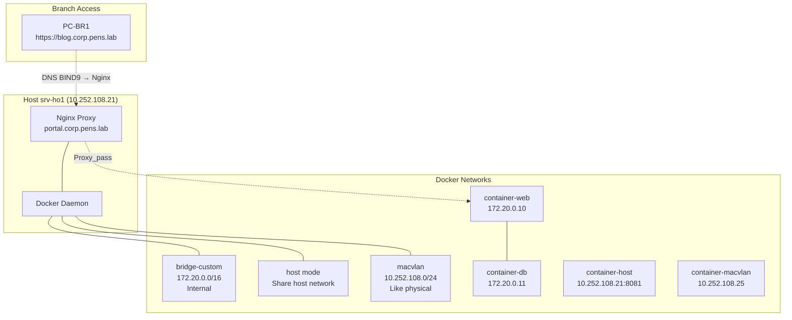

# MINGGU_9_DOCKER
**Topik:** Container Networking (Docker bridge/host/macvlan, Docker Compose)  
**Tema Besar:** Modernize Enterprise Apps dengan Container di Head Office [cite:18]

---

## 1. Tujuan Pembelajaran

Setelah praktikum Minggu 9, mahasiswa mampu: [cite:18]  
- Memahami **3 Docker network modes**: bridge, host, macvlan.  
- Mengkonfigurasi **custom Docker bridge** dengan subnet khusus enterprise.  
- Menggunakan **Docker Compose** untuk deploy multi-container app (web + DB).  
- Mengintegrasikan Docker containers dengan infrastruktur existing (DNS BIND9, Nginx proxy).  

---

## 2. Konteks Skenari Enterprise (Lanjutan Minggu 1-8)

**Container Platform di Head Office** (`srv-ho1`): [cite:14][cite:18]  
- **Docker bridge**: containers di subnet internal 172.20.0.0/16, akses via Nginx proxy.  
- **Docker host**: container share network host (untuk monitoring tools).  
- **Docker macvlan**: container tampil sebagai device terpisah di VLAN backbone.  
- **Compose app**: `blog-app` (WordPress + MySQL) di `blog.corp.pens.lab`.  

Integrasi:  
- DNS BIND9 resolve `blog.corp.pens.lab` → Nginx → Docker container. [cite:1]  
- Grafana (Minggu 7) monitor Docker metrics.  

---

## 3. Topologi Docker Networking



**Flow:** PC-BR1 → Nginx → Docker bridge container → internal DB container.  

---

## 4. Lingkungan Praktikum

Per kelompok: [cite:11][cite:14]  
- `srv-ho1` (Ubuntu 22.04+, semua services Minggu 1-7 aktif).  
- Akses SSH dan `sudo` di srv-ho1.  
- PC-BR1 untuk testing aplikasi dari branch.  

---

## 5. Langkah Praktikum

### 5.1 Install Docker di srv-ho1

```bash
# Install Docker
curl -fsSL https://get.docker.com -o get-docker.sh
sudo sh get-docker.sh
sudo usermod -aG docker $USER  # Logout/login ulang

# Install Docker Compose
sudo curl -L "https://github.com/docker/compose/releases/latest/download/docker-compose-$(uname -s)-$(uname -m)" -o /usr/local/bin/docker-compose
sudo chmod +x /usr/local/bin/docker-compose

docker --version
docker-compose --version
```

### 5.2 Praktik 1: Docker Network Modes

1. **Default Bridge (docker0):**  

```bash
docker run -d --name web-default nginx:alpine
docker network ls
docker inspect web-default | grep IPAddress -A 5
```

Test: `curl $(docker inspect -f '{{range .NetworkSettings.Networks}}{{.IPAddress}}{{end}}' web-default):80`

2. **Host Network:**  

```bash
docker run -d --name web-host --network host nginx:alpine
curl localhost:80  # Akses langsung host port 80
```

3. **Custom Bridge Network:**  

```bash
docker network create --driver bridge --subnet=172.20.0.0/16 --gateway=172.20.0.1 my-bridge
docker run -d --name web-bridge --network my-bridge nginx:alpine
docker network inspect my-bridge
```

### 5.3 Praktik 2: Macvlan Network (Advanced)

**Catatan:** Macvlan butuh parent interface yang terhubung ke switch (br0/enp1s0).  

```bash
docker network create -d macvlan \
  --subnet=10.252.108.0/24 \
  --gateway=10.252.108.254 \
  -o parent=br0 \
  macvlan-net

docker run -d --name macvlan-container \
  --network macvlan-net \
  --ip 10.252.108.25 \
  nginx:alpine

# Test dari PC lain
ping 10.252.108.25
curl http://10.252.108.25
```

### 5.4 Praktik 3: Docker Compose Multi-Container App

Buat `docker-compose.yml`:  

```yaml
version: '3.8'
services:
  wordpress:
    image: wordpress:6.4-apache
    restart: always
    ports:
      - "8081:80"
    environment:
      WORDPRESS_DB_HOST: db
      WORDPRESS_DB_USER: wordpress
      WORDPRESS_DB_PASSWORD: pens123
      WORDPRESS_DB_NAME: wordpress
    volumes:
      - wordpress_data:/var/www/html
    networks:
      - blog-net

  db:
    image: mysql:8.0
    restart: always
    environment:
      MYSQL_DATABASE: wordpress
      MYSQL_USER: wordpress
      MYSQL_PASSWORD: pens123
      MYSQL_ROOT_PASSWORD: rootpens123
    volumes:
      - db_data:/var/lib/mysql
    networks:
      - blog-net

volumes:
  wordpress_data:
  db_data:

networks:
  blog-net:
    driver: bridge
    ipam:
      config:
        - subnet: 172.21.0.0/16
```

Deploy:  

```bash
docker-compose up -d
docker-compose ps
docker-compose logs wordpress
```

Test: `curl localhost:8081` → WordPress setup page.  

### 5.5 Integrasi dengan Enterprise Infrastructure

1. **Update BIND9** (Minggu 3): tambah `blog.corp.pens.lab A 10.252.108.21`.  

2. **Proxy via Nginx** (Minggu 5): tambah location di `portal.corp.pens.lab`:  

```nginx
location /blog/ {
    proxy_pass http://127.0.0.1:8081/;
    proxy_set_header Host $host;
    proxy_set_header X-Real-IP $remote_addr;
}
```

3. **Test dari PC-BR1:** `https://portal.corp.pens.lab/blog/` → WordPress app.  

---

## 6. Tugas Praktikum

### 6.1 Tugas Konfigurasi

1. Deploy **docker-compose.yml** WordPress + MySQL di `srv-ho1`.  
2. Buat **custom Docker network** `kelompok-net` (subnet 172.22.0.0/16).  
3. Deploy **2 containers tambahan** di custom network:  
   - `nginx-kelompok` (expose port 8082).  
   - `busybox-kelompok` (test inter-container communication).  
4. **Integrasikan** dengan Nginx proxy: `https://portal.corp.pens.lab/kelompok/` → nginx-kelompok.  
5. Test akses dari PC-BR1 + screenshot Docker networks.  

### 6.2 Pertanyaan Teori

1. Jelaskan perbedaan **bridge**, **host**, **macvlan** network modes. Kapan menggunakan masing-masing di enterprise?  
2. Apa fungsi `ipam` di Docker Compose network? Mengapa custom subnet berguna?  
3. Bagaimana Docker overlay network berbeda dari bridge? Kaitkan dengan Kubernetes (Minggu 10).  
4. Mengapa container networking butuh **DNS resolution internal**? Bagaimana Docker handle ini?  

### 6.3 Pertanyaan Setelah Praktik

1. WordPress app accessible dari branch via Nginx proxy?  
2. Inter-container communication di custom network sukses?  
3. Macvlan container pingable dari backbone?  

---

## 7. Output yang Harus Dikumpulkan

Laporan: [cite:18]  

1. File: `docker-compose.yml` + customizations.  
2. Screenshot:  
   - `docker network ls` dan `docker-compose ps`.  
   - Akses `portal.corp.pens.lab/blog/` dan `/kelompok/` dari PC-BR1.  
   - `docker network inspect kelompok-net`.  
3. Jawaban pertanyaan.  

---

## 8. Checklist Asisten

- [ ] Docker + Compose installed dan running.  
- [ ] WordPress multi-container app accessible.  
- [ ] Custom network + 2 containers tambahan.  
- [ ] Nginx proxy integration + branch access.  
- [ ] Laporan lengkap.  

**Troubleshooting:**  
| Masalah | Solusi |  
|---------|--------|  
| Port conflict | `docker-compose down`, cek `docker ps` |  
| Network no IP | Restart Docker: `sudo systemctl restart docker` |  
| Proxy 502 | Container port expose benar |  

---
